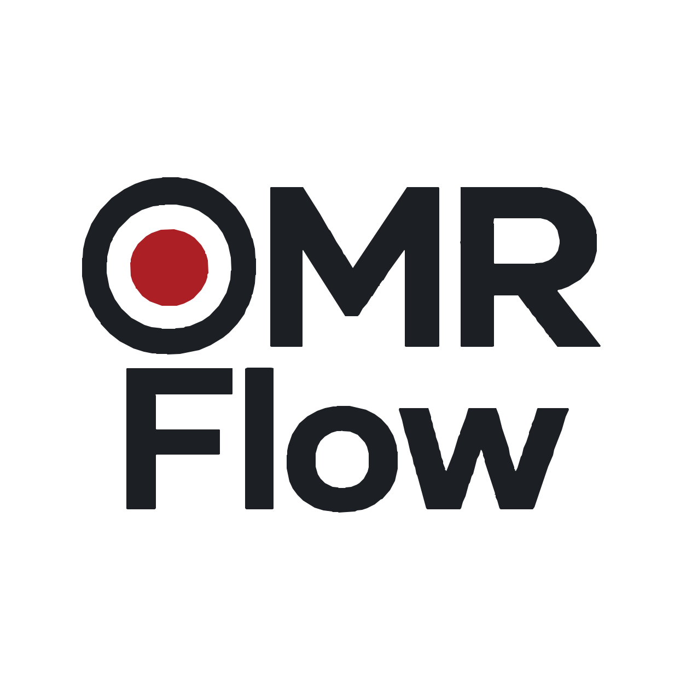

# OMRFlow

**Open-source Optical Mark Recognition (OMR) scanner and examination
processing software for Windows.**

OMRFlow lets educators and examination administrators design OMR
bubble-sheet templates, process scanned answer sheets, review uncertain
marks, reconcile attendance, score MCQ examinations, and generate
auditable Excel results locally.
<div align="center">



**Design OMR templates, process scanned answer sheets, resolve recognition
conflicts, reconcile candidate attendance, evaluate MCQ examinations and
generate auditable results — entirely on your own machine.**

[](https://github.com/sajidbuet/OMRFlow/releases)
[](docs/wiki/Known-Limitations.md)
[](docs/wiki/Installation.md)
[](pyproject.toml)
[](LICENSE)

</div>


<div align="center"><sub>A demonstration project, a real template, and one real
sheet recognised — captured from the running application by
<a href="scripts/generate_readme_demo.py"><code>scripts/generate_readme_demo.py</code></a>.</sub></div>

---

> ## ⚠️ Alpha release
>
> **OMRFlow is currently available as an Alpha release for evaluation and
> testing.** Core workflows are implemented and covered by an automated suite
> of over four thousand tests, but **real examination-data qualification is
> still underway** — no real attendance workbook and no real scanned cohort
> has been processed end to end.
>
> **Generated results should be independently verified before operational
> use.** See **[Known Limitations](docs/wiki/Known-Limitations.md)** for
> exactly what has and has not been validated.

---

## What is OMRFlow?

OMRFlow reads optical-mark-recognition answer sheets and turns them into
examination results. You mark up a blank sheet once to make a template, scan
the completed sheets on an ordinary document scanner, and OMRFlow aligns each
page, reads the marks, tells you what it was unsure about, matches the
scripts against your candidate list, scores them against a verified answer
key, and produces result workbooks built on your own attendance workbook.

It is a flexible, transparent, locally operated alternative to proprietary
OMR systems:

**ordinary image scanner + configurable template + transparent recognition +
human verification + reproducible result processing**

Nothing is uploaded anywhere. A project is a folder on your disk.

## Key features

- **Template designer** — registration markers, bubble grids, per-bubble
  adjustment, validation. Coordinates are normalised, so one template works
  at any scan resolution.
- **Geometric normalisation** — rotation, translation, scale, skew and
  perspective corrected to the template's canonical page before anything is
  measured.
- **Transparent recognition** — a blank, a multiple mark and an uncertain
  read are reported as what they are, never silently resolved into an answer.
- **Multicore batch processing** — one sheet per CPU worker, with identical
  results and output ordering on any number of cores.
- **Durable batches** — an interrupted run resumes without reprocessing what
  it already read. Power loss included.
- **Human resolution with an audit trail** — every correction is recorded
  append-only beside the machine's original reading, attributed to a named
  reviewer with a reason.
- **Attendance reconciliation** — unknown, duplicate and missing scripts,
  absent-with-script and present-without-script, each decided explicitly.
- **Per-set answer keys and scoring** — verification required before use,
  negative marking, defective questions, standard competition ranking.
- **Reports built on your own workbook** — your columns, fonts, merged cells
  and institution logo are preserved, because the report is a copy of your
  attendance workbook with the results written into it.
- **Examination sets** — one project can describe an examination divided into
  several question papers, carried through attendance, keys and reporting.
- **Project health, backup and recovery** — integrity checking that reports
  and never silently repairs.

## The application window

OMRFlow puts everything above your work into **one compact row**, which is
also the window's title bar:

```text
┌──────────────────────────────────────────────────────────────────────────┐
│ ☰  OMRFlow │ − +  ‹  1 Project › 2 Template › … › 9 Reports  ›   _  ☐  ✕ │
├──────────────────────────────────────────────────────────────────────────┤
│  the stage you are on                                                    │
├──────────────────────────────────────────────────────────────────────────┤
│ OMRFlow v… │ Project: …      Developed by … │ Open Source (MIT) │ ● Ready│
└──────────────────────────────────────────────────────────────────────────┘
```

- **One chrome row.** The application menu, the wordmark, the workflow and the
  window buttons share a single line. There is no separate header band and no
  stage heading repeating what the ribbon already says, which leaves the
  Template, Calibrate, Scan, Resolve and Reports stages close to the whole
  window to work in — including on a 1366×768 display.
- **The workflow is always one line.** All nine stages when they fit; a
  horizontally scrolling strip when they do not; and at very narrow widths the
  current stage alone, with the other eight one hover, click or keypress away
  in a selector. It never wraps onto a second row, and no stage is ever
  hidden from navigation.
- **The active stage is always visible.** However you move — a click, the
  `‹`/`›` arrows, a menu command, a keyboard shortcut — the ribbon scrolls it
  into view or becomes it.
- **`−` and `+` set how much room the workflow takes**, not how big the page
  is. They change the ribbon's padding only, within readable limits, and your
  choice is remembered in your own settings — no project file is involved.
- **The footer says which project is open**, by its examination title rather
  than its folder path, and updates the moment you create, open, rename or
  close one.
- **It still behaves like a Windows window.** Drag it by the logo or the empty
  space in the row, double-click there to maximise, resize from any edge or
  corner, and use Aero Snap, Alt+F4, Win+Up and Win+Down as usual — the window
  manager does all of that, not a hand-rolled substitute. The one thing
  framelessness costs is the system drop shadow; a hairline border stands in
  for it.

## Current release status

**`0.1.0-alpha.2`** — the current Alpha build.

| | |
|---|---|
| Release channel | **Alpha** — for evaluation and testing |
| Platform | Windows 10 1809 or newer, 64-bit |
| Installer | Unsigned; SmartScreen will warn |
| Real-data qualification | **Incomplete** |

The release channel is derived from the version string, so a build cannot
claim a maturity its version does not support.

## Download and installation

Get `OMRFlow-0.1.0-alpha.2-Setup-x64.exe` from the
**[Releases page](https://github.com/sajidbuet/OMRFlow/releases)**. No Python
required.

Verify the download against the published `SHA256SUMS.txt` — the installer is
unsigned, so the checksum is how you confirm you have the file that was
built:

```powershell
certutil -hashfile OMRFlow-0.1.0-alpha.2-Setup-x64.exe SHA256
```

Full instructions, including the SmartScreen warning and where your data
lives: **[Installation](docs/wiki/Installation.md)**.

## Quick start

**[Quick Start](docs/wiki/Quick-Start.md)** walks the whole workflow in about
half an hour using **synthetic data OMRFlow generates itself** — so you can
see what it does without needing real answer sheets:

create a project → open the example template → generate synthetic sheets →
process them → resolve what recognition flagged → import a candidate list →
enter an answer key → score → generate reports.

## Documentation

| | |
|---|---|
| **[Documentation home](docs/wiki/Home.md)** | Everything, organised |
| [Installation](docs/wiki/Installation.md) | Requirements, install, upgrade, uninstall |
| [Quick Start](docs/wiki/Quick-Start.md) | The whole workflow, with synthetic data |
| [Synthetic datasets](docs/testing/SYNTHETIC_DATA.md) | Generating test scans **and** attendance workbooks with exact ground truth |
| [User Guide](docs/wiki/User-Guide.md) | The nine stages in detail |
| [Known Limitations](docs/wiki/Known-Limitations.md) | **What is and is not trustworthy yet** |
| [Troubleshooting](docs/wiki/Troubleshooting.md) | When something goes wrong |
| [Upgrading](docs/wiki/Upgrading-OMRFlow.md) | And what happens to your projects |
| [Development Roadmap](docs/wiki/Development-Roadmap.md) | Phase status and what is next |
| [Architecture](docs/wiki/Developer-Architecture.md) | For contributors |
| [Release Process](docs/wiki/Release-Process.md) | How a release is made |

## Development status

**Current release: `0.1.0-alpha.2`**

Phases 0–10 are implemented; Phase 11 takes OMRFlow from "implemented and
synthetically tested" to a qualified stable release.

| Phase | Status |
|---|---|
| 0–2 — Foundation, geometry, template designer | **Complete** |
| 3–9 — Recognition, calibration, batch, conflicts, attendance, scoring, reporting | Implemented; synthetic testing complete, real-data testing in progress |
| 10 — Integration, recovery, production hardening | Implemented; 100,000-sheet acceptance run pending |
| **11A — Alpha release infrastructure** | **Implemented — validation pending**; release automation complete and tested, clean-machine test run and passed, its manual steps outstanding |
| 11B — Real-data qualification & Beta | Pending |
| 11C — Release candidate & stable | Pending |

### Testing status

| | |
|---|---|
| Automated suite | 4,293 tests passing (3 skipped: no LibreOffice, no desktop window manager), plus `ruff` and `mypy` |
| Cross-platform CI | ✅ Green on Windows and Ubuntu ([run 35809212682](https://github.com/sajidbuet/OMRFlow/actions/runs/35809212682), 2026-09-23); a fourth Ubuntu-only defect found and fixed for this release |
| Synthetic end-to-end | ✅ Passing, from source |
| Synthetic qualification data | ✅ Template-driven scans **and** set-specific attendance workbooks with deliberate reconciliation conflicts and exact ground truth — see [Synthetic datasets](docs/testing/SYNTHETIC_DATA.md) |
| Packaged application | ✅ Launches, navigates and closes cleanly under UI Automation |
| Installer | ✅ Install → launch → uninstall → **user data preserved** → reinstall |
| Clean machine | ✅ 56/56 automated checks on a pristine Windows image; its manual steps outstanding |
| Accessibility | 🟠 Automated checks pass; 8 controls have no accessible name (recorded, non-blocking at Alpha) |
| Real examination data | ❌ **Not started** — this is Phase 11B |
| 100,000-sheet qualification | ⚪ Harness ready, not run |
| Release automation | ✅ One command prepares a release; GitHub Actions builds and publishes it. 96 tests, no step needs a person or a model — see [Release Checklist](docs/release/RELEASE_CHECKLIST.md) |

#### Cross-platform CI defects fixed

Four Ubuntu-only failures, all of them the suite correctly reporting a genuine
platform difference rather than flakiness:

| Defect | Cause | Fix |
|---|---|---|
| `mypy` reported an unreachable statement in `services/process_containment.py` | The Windows path sat behind an early `return` rather than a `sys.platform` *block*; mypy exempts platform-guarded branch bodies from `--warn-unreachable`, but not code following an early return | Restructured into `if sys.platform == "win32": … else: …`. No `type: ignore`, no change to the mypy configuration |
| Workflow labels elided in layouts chosen *because* the labels fit | `QFontMetrics.horizontalAdvance` sums glyph advances, `elidedText` lays the text out; they disagree by up to a pixel of right bearing, so a step drawn at exactly its measured width elides | One pixel of measured headroom per step (`ELISION_SLACK`), plus a test that pins the invariant at the exact boundary |
| The kill/resume test asserted that workers die with the coordinator | That is a Windows Job Object guarantee; `process_containment` documents that no POSIX equivalent is implemented | The Windows guarantee is still asserted on Windows; every other property is still asserted everywhere; surviving workers are reaped so no run leaks processes |
| A synthetic-dataset test compared ink over a fixed percentage crop of the raw page | Two causes. The sheet it measured was picked from an unsorted `glob`, so a different filesystem chose a different candidate — and a different candidate has a different number of marked bubbles, which *is* the measurement. The crop itself was also meaningless: a rendered sheet is not in canonical coordinates, since it carries a scan margin and the geometry cases rotate and crop it, so the rectangle covered whatever happened to fall in it | The scan is rectified with `align_sheet` and its bubbles measured with `measure_bubbles` — the same pair recognition uses — and the representative sheet comes from a sorted listing. Compared on `fill_ratio`, which is normalised against levels read from the image itself. A second test now also pins that a blank identifier renders *no* marked bubble at all |

The first three were verified locally with `mypy --platform linux` and the GUI
suite under `QT_QPA_PLATFORM=offscreen`, and then **confirmed green on the
Ubuntu runner itself** in
[run 35809212682](https://github.com/sajidbuet/OMRFlow/actions/runs/35809212682).
The fourth was found by the Ubuntu runner afterwards, in
[run 35959715301](https://github.com/sajidbuet/OMRFlow/actions/runs/35959715301),
and is fixed in this release.

### Release qualification infrastructure

Release qualification is a local, unattended framework — one command, a
machine-readable report, a meaningful exit code, and no supervision:

```powershell
python tools\release_validation\validate_release.py --safe   # no install/uninstall
python tools\release_validation\validate_release.py --all    # including the installer
```

It covers source tests, Qt GUI behaviour, accessibility, an end-to-end workflow
smoke test, the built bundle, the **packaged executable**, and the installer
round trip. See
**[`tools/release_validation/README.md`](tools/release_validation/README.md)**.

Current qualification focus:

- real examination datasets and real scanner output;
- real attendance workbooks;
- set-specific end-to-end validation;
- the clean-machine steps that need a person;
- a green Ubuntu CI run **for this release**: the Ubuntu runner has been green
  since the first three cross-platform defects were fixed, but the fourth was
  found after that and its fix has been verified only on Windows so far.

**Implemented, automated tests passing, synthetic dataset validated, real
scanned dataset validated and production validated are five different
things, and OMRFlow currently claims the first three.**

Detail: **[Development Roadmap](docs/wiki/Development-Roadmap.md)** ·
[Known Limitations](docs/wiki/Known-Limitations.md) ·
[Detailed status and capabilities](docs/wiki/Detailed-Development-Status.md)

## Running from source

```powershell
git clone https://github.com/sajidbuet/OMRFlow.git
cd OMRFlow
python -m venv .venv
.\.venv\Scripts\Activate.ps1
pip install -e ".[dev]"
python -m omr_scanner.main
```

Requires Python 3.12 or newer. Also the route to take if your organisation
will not permit an unsigned installer. See
[Development Setup](docs/wiki/Development-Setup.md).

```powershell
.\scripts\release\Invoke-Tests.ps1          # ruff, mypy and the test suite
.\scripts\release\Invoke-Tests.ps1 -Fast    # unit tests only
```

## Contributing

Contributions are welcome. Please read
**[CONTRIBUTING.md](CONTRIBUTING.md)** first — in particular the parts about
tests, database migrations, and never committing real candidate data.

- **Report a problem:** [open an issue](https://github.com/sajidbuet/OMRFlow/issues/new/choose),
  after reading [SUPPORT.md](SUPPORT.md) on how to sanitise a reproduction.
- **Security or privacy:** [SECURITY.md](SECURITY.md) — **not** a public
  issue.

> **OMRFlow processes examination material.** Never attach real candidate
> names, roll numbers, rosters, answer keys, scans or project folders to a
> public issue. OMRFlow can generate synthetic sheets — and synthetic
> attendance workbooks — for exactly this purpose:
> *Tools → Developer / Testing → Generate Synthetic Test Dataset…*

## Privacy

OMRFlow has **no telemetry, no analytics and no network access** during
examination processing. Everything stays in the project folder on your disk.
Treat that folder as confidential examination material — see
[Backup & Data Retention](docs/wiki/Backup-and-Data-Retention.md).

## Licence

[MIT](LICENSE). © 2026 Dr. Sajid Muhaimin Choudhury.

## Developer

Developed by **[Dr. Sajid Muhaimin Choudhury](https://www.sajid.bd)**,
Department of Electrical and Electronic Engineering, Bangladesh University of
Engineering and Technology, with development assistance from ChatGPT and
Claude Code.
