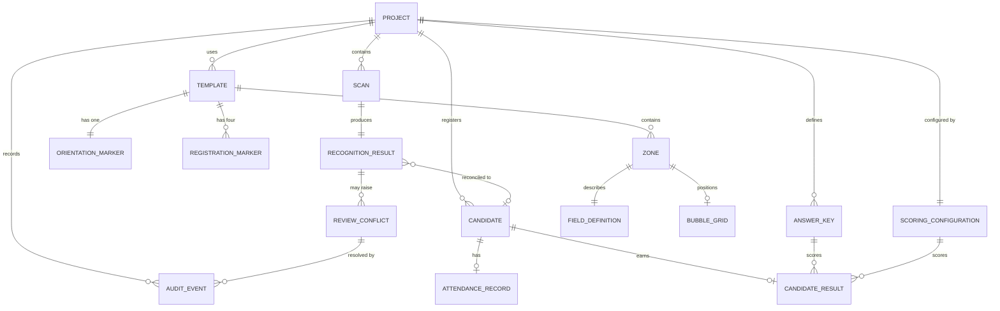

# Data model

This document describes the entities OMRFlow needs across the whole roadmap and
how they relate. It is a **design document**: most entities are not implemented
yet, and each one is marked with the phase that introduces it.

Implementing an entity early, "because we will need it anyway", is explicitly
discouraged - a speculative column is a column nobody knows the rules for. What
this document guarantees instead is that when a phase does implement its
entities, it finds the intended shape and relationships already agreed.

## Status summary

| Entity | Status | Storage |
|---|---|---|
| Project | Implemented (Phase 0) | `project.json` + `project_setting` table |
| Template, Zone, FieldDefinition, RegistrationMarker, OrientationMarker, BubbleGrid, RecognitionSettings | Implemented (Phase 0) | `.omrt` document |
| ScanBatch | Implemented (Phase 5) | `scan_batch` table |
| BatchScan (one scan in a batch) | Implemented (Phase 5) | `batch_scan` table |
| RecognitionResult | Implemented (Phase 5) | `batch_scan.result_json` |
| FieldValue (per-zone, as its own row) | **Not implemented — superseded** (Phase 6) | — |
| ReviewConflict (was RecognitionConflict) | Implemented (Phase 6) | `review_conflict` table |
| AuditEvent | Implemented (Phase 6) | `audit_event` table |
| Provenance / effective value | Implemented (Phase 6) | *projected*, not stored |
| CandidateRoster | Implemented (Phase 7) | `candidate_roster` table |
| RegisteredCandidate | Implemented (Phase 7) | `registered_candidate` table |
| AttendanceRecord | **Not implemented — superseded** (Phase 7) | — |
| ReconciliationRun | Implemented (Phase 7) | `reconciliation_run` table |
| CandidateReconciliation | Implemented (Phase 7) | `reconciliation_entry` + `reconciliation_script` |
| ReconciliationResolution | Implemented (Phase 7) | `reconciliation_decision` table |
| AnswerKey | Planned (Phase 8) | database |
| ScoringConfiguration | Planned (Phase 8) | database |
| CandidateResult | Planned (Phase 8/9) | database |

## Entity relationships

## Entities

### Project - *implemented*

An examination workspace on disk. Identity lives in `project.json`; the SQLite
database is the authoritative store for working data.

| Field | Type | Notes |
|---|---|---|
| `project_format_version` | int | Refuses to open a newer format. |
| `project_id` | uuid string | Stable; never regenerated. Referenced by exports. |
| `name` | str | Also the default folder name; validated as a portable folder name. |
| `description` | str | Free text. |
| `created_at`, `modified_at` | datetime (UTC, aware) | Naive timestamps are rejected. |
| `created_with` | str | OMRFlow version, for diagnostics. |

Directory layout and rationale: `docs/decisions/ADR-0002-project-on-disk-layout.md`.

### Template and its parts - *implemented*

Fully specified in `docs/TEMPLATE_FORMAT.md`. Summary of the relationships:

- a **Template** owns exactly four **RegistrationMarkers** (one per corner role),
  exactly one **OrientationMarker**, any number of **Zones**, and one default
  **RecognitionSettings**;
- a **Zone** has bounds, one **FieldDefinition** (numeric, alphanumeric, set
  code, question block or ignored), an optional per-zone **RecognitionSettings**
  override, and - unless it is ignored - a **BubbleGrid**;
- a **BubbleGrid** stores an origin plus row/column pitch, with optional explicit
  overrides for irregular cells.

Templates are versioned documents, not database rows, so that a sheet design can
be shared between projects and reviewed in version control.

### ScanBatch - *implemented (Phase 5)*

One run over a folder of scans. Table `scan_batch`.

Fields: `batch_id` (UUID hex), `created_at`, `updated_at`, `source_folder`,
`template_id`, `template_name`, `template_path`, `geometry_fingerprint`,
`recognition_fingerprint`, `engine_version`, `settings_json`, `status`,
`total_scans`.

`status` is one of `new`, `running`, `interrupted`, `cancelled`, `completed`,
`completed_with_errors`. The last two are deliberately distinct: "the loop
finished" and "the work succeeded" are different claims, and only the second
may be reported as success.

The two fingerprints are why resume can refuse to mix results. They are the
same hashes `OmrTemplate` computes for Phase 4's calibration staleness check,
so a template edited between two halves of a batch is detected by the same
mechanism in both places.

### BatchScan - *implemented (Phase 5)*

One scanned sheet inside a batch. Table `batch_scan`, unique on
`(batch_id, source_path)`.

Fields: `scan_id`, `batch_id`, `batch_index`, `source_path`, `filename`,
`file_size`, `modified_at`, `status`, `attempt_count`, `outcome`,
`registration`, `identifier_value`, `set_code_value`, `output_name`,
`output_path`, `copied`, `error_code`, `error_category`, `error_message`,
`result_json`, `started_at`, `finished_at`, `duration_seconds`.

`status` is one of `pending`, `queued`, `processing`, `completed`, `warning`,
`failed`, `cancelled`. Every state is either *terminal* (work a resume must
keep) or *resumable*; a test asserts that no state is somehow neither, because
a scan in such a state would be invisible to both the resume query and the
completed count.

Invariants:
- **original scans are never modified or moved** - only the path is stored, so
  importing a folder does not duplicate gigabytes of images. Asserted by a
  hash-before/hash-after test.
- `batch_index` is the enumeration order and never changes, because it is what
  a resumed run replays - and therefore what decides which of two sheets
  sharing a roll number keeps the plain output name.
- `file_size` and `modified_at` record what the file looked like when it was
  enumerated. Cheap, and enough to notice a source replaced between runs;
  hashing every scan would read the whole batch twice for a check that almost
  never fires.

### RecognitionResult - *implemented (Phase 5)*

Stored as JSON in `batch_scan.result_json`, via
`ScanResult.to_dict()`/`from_dict()`.

Deliberately *not* exploded into typed columns: that serialisation is already a
versioned, round-tripping contract with its own schema version, and duplicating
its forty-odd fields as columns would mean a migration every time recognition
gained a measurement. The handful of columns that *are* typed alongside it are
exactly the ones a query needs to filter or sort on without decoding every row.

### FieldValue - *not implemented; superseded in Phase 6*

Planned as one row per recognised zone, for a conflict queue to point at. Phase
6 did not build it, and the reason is worth recording.

Every recognised field already exists, structured and versioned, inside
`batch_scan.result_json`. A parallel `field_value` table would have been a
**second copy of the same values**, kept in step by application code — and the
one defect this phase most had to avoid is an interface that shows a value
different from the one the engine produced. Two stores is precisely how that
happens.

So a conflict **references** a field rather than duplicating it:
`(zone_id, group_key)` addresses a group in the stored result, resolved through
`recognition/fields.py`, which is the same mapping recognition itself used. The
machine's reading is snapshotted onto the conflict row for querying and display,
but the result remains the single source of what was recognised.

The invariant the original design was protecting is kept in full, and is
enforced harder than a separate table would have managed: **the machine value is
never overwritten**, and a human correction is a new `audit_event` row that a
trigger forbids anyone from rewriting.

If a later phase needs per-field rows for scoring or reporting, it should
derive them from the stored result rather than have recognition write to two
places.

### ReviewConflict - *implemented (Phase 6)*

One thing on one sheet that a person needs to look at. Table `review_conflict`.

Fields: `conflict_id`, `batch_id`, `scan_id`, `conflict_type`, `scope`,
`zone_id`, `group_key`, `field_kind`, `field_label`, `question_number`,
`machine_value`, `machine_status`, `machine_confidence`, `machine_detail`,
`state`, `detected_at`, `updated_at`.

Identity is `(batch_id, scan_id, conflict_type, zone_id, group_key)`, enforced
by the unique constraint `review_conflict_identity`. That is what makes
detection **idempotent**: re-running, resuming or retrying a batch updates the
existing conflicts instead of creating a second set. Two indexes support the
queue — `(batch_id, state)` for filtering and counting, `(scan_id)` for a
sheet's own conflicts.

`conflict_type` is one of 22 values (`omr_scanner.domain.review.ConflictType`),
`state` one of `open` / `resolved` / `deferred` / `withdrawn`.

Invariants:
- the `machine_*` columns are written at detection and changed **only** by a
  re-read, which appends a `re_recognised` audit event first. No human action
  touches them.
- `state` is a **cache**, not the truth. The authoritative state is the fold
  over that conflict's audit events; `recompute_state` rebuilds the column from
  them, and a test asserts the two agree.
- conflicts are **never deleted**. One the machine no longer raises becomes
  `withdrawn`; the fact that it was once disputed is evidence.
- a machine re-read may withdraw its own complaint but **never** overrides a
  state a person set.

### Provenance and the effective value - *implemented (Phase 6); not stored*

There is no `resolved_value` column, deliberately. The final value of a field is
**projected** by `review_store.provenance_for` as a left-fold over that
conflict's audit events in order, starting from the machine's reading.

A stored resolved value would be a third copy of the truth, and would have to be
kept correct across corrections, reopenings and re-corrections by application
code. The fold cannot drift, because there is nothing to drift *from*: the
events are the record, and one function reads them.

`Provenance` carries the effective value, its source (`machine` / `human`), the
machine value, the reviewer, the reason, the timestamp and the originating event
— everything the traceability requirement asks for, all derived.

### CandidateRoster and RegisteredCandidate - *implemented (Phase 7)*

`candidate_roster` is one import: `roster_id`, `created_at`, `source_name`,
`source_sheet`, `source_format`, `column_map`, `rows_read`, `candidate_count`,
`expected_present`, `expected_absent`, `attendance_unknown`,
`has_attendance_column`, `is_active`, `imported_by`.

`registered_candidate` is one candidate exactly as the file declared them:
`candidate_row_id`, `roster_id`, `candidate_id`, `display_name`, `row_order`,
`source_row`, `imported_attendance`, `imported_value`. Unique on
`(roster_id, candidate_id)`, which is what makes a duplicate ID impossible to
store even if validation were bypassed, and is the index scripts are matched
through.

Invariants:
- **`registered_candidate` is write-once.** Nothing in the application updates
  a row after import. An operator who establishes that a candidate recorded
  absent actually attended creates a `reconciliation_decision` beside it; the
  entry then reports both values. That separation is the only reason this table
  exists rather than a mutable "candidate" table.
- `imported_value` keeps the **raw cell**, so an operator can see that the
  sheet said `abs` rather than `ABSENT`.
- Only `source_name` is stored, never the source path: a project database is
  shared, and a path can name somebody's home directory. The file itself is
  never modified, moved or copied in.
- Several rosters may exist; exactly one `is_active`. A re-import supersedes
  rather than merges, and the superseded roster is kept because decisions were
  taken against it.

Privacy: candidate names and IDs are project data. They must not appear in
logs, in bug reports or in committed fixtures. See
[`reconciliation.md`](reconciliation.md) §9.

### AttendanceRecord - *not implemented; superseded in Phase 7*

Planned as a separate row recording a declared `present`/`absent` state with a
source and a timestamp. Phase 7 did not build it.

The imported state is an attribute of the roster row
(`registered_candidate.imported_attendance`), written once and never touched. A
human override is a `reconciliation_decision`, and every change is already in
`audit_event` with its actor, reason and timestamp. A third table holding "the
attendance state" would have been a place for those two to disagree, and the
only thing it would have added is a second answer to a question that must have
one.

### ReconciliationRun - *implemented (Phase 7)*

`run_id`, `roster_id`, `batch_id`, `created_at`, `updated_at`, `counts` (JSON).
Unique on `(roster_id, batch_id)` - **one row per pair, updated in place**. A
row per *run* would grow without bound and, worse, leave yesterday's
classifications in the database looking current.

### ReconciliationEntry and ReconciliationScript - *implemented (Phase 7)*

`reconciliation_entry` is one candidate's state, or one group of scripts that
belong to no registered candidate: `entry_id`, `roster_id`, `batch_id`,
`entry_key`, `entry_order`, `candidate_row_id` (null for an unplaced script),
`candidate_id`, `display_name`, `is_registered`, `status`, `issues`,
`script_count`, `excluded_count`, `imported_attendance`,
`effective_attendance`, `attendance_source`, `resolution`, `reason_code`,
`reason_text`, `reviewer`, `updated_at`.

`reconciliation_script` is the link between one scan and the entry it was filed
under: `link_id`, `roster_id`, `batch_id`, `entry_id`, `scan_id`,
`source_name`, `machine_candidate_id`, `effective_candidate_id`,
`assigned_candidate_id`, `assignment`, `identifier_unresolved`, `excluded`,
`is_primary`, `reason_code`, `reason_text`, `reviewer`, `updated_at`.

Invariants:
- **Both tables are a cache of a pure function.**
  `services.reconciliation.reconcile()` recomputes every column from the
  roster, the scripts and the standing decisions, and `reconcile_batch`
  rewrites them wholesale. They are stored so a ten-thousand-candidate cohort
  can be filtered, counted and paged in SQL rather than in Python.
- **One `reconciliation_script` row per scan in the batch, always** - including
  a script belonging to nobody and one an operator has set aside. A script
  missing from this table would be missing from every count and every screen,
  which is the one thing this phase forbids.
- `issues` is a comma-separated **set**, not a single status, because the
  conditions genuinely co-occur. A schema holding one would make a physical
  script invisible.
- `machine_candidate_id` is never overwritten by a human assignment;
  `assigned_candidate_id` records that separately.

### ReconciliationDecision - *implemented (Phase 7)*

`decision_id`, `roster_id`, `batch_id`, `target_kind` (`script`/`candidate`),
`target_key`, `assigned_candidate_id`, `attendance_override`, `excluded`,
`is_primary`, `dismissed`, `reason_code`, `reason_text`, `reviewer`,
`decided_at`, `updated_at`. Unique on
`(roster_id, batch_id, target_kind, target_key)`.

The **input** to reconciliation, not an output - which is why it lives apart
from the two tables above, whose every column is disposable. Re-running
recomputes every classification from scratch and these rows are what steer it.

A decision is a *current* position; its history is in `audit_event`, appended in
the same transaction and never rewritten.

### AnswerKey - *Phase 8*

One key per question paper set: `set_code`, `question_number`,
`correct_answers`.

`correct_answers` is a collection even though the first release assumes exactly
one correct answer, so that "any of B or C is accepted" can be introduced later
without a migration of the meaning of existing rows.

### ScoringConfiguration - *Phase 8*

`marks_correct` (default +1.00), `marks_incorrect` (default -0.25),
`marks_blank` (default 0.00), `negative_marking_enabled`, and a rounding rule.

Initially uniform across all questions. Section-wise scoring is a later
extension; it would attach a configuration to a question range rather than
changing the per-candidate result shape.

### CandidateResult - *Phase 8/9*

Per candidate: `set_code`, `attendance_state`, `correct_count`,
`incorrect_count`, `blank_count`, `positive_marks`, `negative_marks`,
`final_marks`, `rank`, `processing_status`, `remarks`.

`rank` is stored so that an exported report and the database agree, even when
the report also contains an Excel `RANK.EQ` formula.

### AuditEvent - *implemented (Phase 6)*

Append-only history of anything that can change a result. Table `audit_event`.

Fields: `event_id`, `occurred_at`, `entity_type`, `entity_id`, `batch_id`,
`scan_id`, `conflict_id`, `action`, `reviewer`, `previous_value`, `new_value`,
`machine_value`, `reason_code`, `reason_text`, `detail`.

`entity_type` and `entity_id` were added by **migration 4** (Phase 7), so the
same ledger can record decisions about candidates and scripts as well as
conflicts. Rows written before that migration read back as
`entity_type='conflict'`, `entity_id=0`; their `conflict_id` still identifies
them, and it is what a conflict's history is queried by, so nothing had to be
rewritten. **Deliberately no backfill** — an `UPDATE` would have been aborted by
the immutability triggers, which is exactly the behaviour those triggers exist
for.

Append-only is the whole point: rows are never updated or deleted, so the
question "why does this candidate have this mark?" always has an answer.
Enforced at three levels — no update or delete on the service surface, none
anywhere in the application, and two SQLite triggers that abort either one
outright. See [`conflict_review.md`](conflict_review.md) §7.

**No foreign key**, deliberately. A conflict row may one day be removed by
housekeeping; the record that a named person decided something must outlive it.
That is also what let Phase 7 start auditing candidates and scripts here without
touching a constraint.

`action` for a conflict is one of `detected`, `re_recognised`, `accepted`,
`corrected`, `deferred`, `reopened`, `withdrawn`. The first two are the
machine's; the rest require a named reviewer, and `corrected` additionally
requires a reason. Phase 7 adds its own actions under `entity_type` of
`candidate` or `script` — see [`reconciliation.md`](reconciliation.md).

## Persistence strategy

| Table | Purpose | Added by |
|---|---|---|
| `schema_migration` | Ledger of applied migrations: version, description, timestamp, writing application version. | Phase 0 (migration 1) |
| `project_setting` | Key/value mirror of project identity, so a stray `database.sqlite` can still be identified. | Phase 0 (migration 1) |
| `scan_batch` | One run over a folder of scans. | Phase 5 (migration 2) |
| `batch_scan` | One scanned sheet inside a batch, with its stored result. | Phase 5 (migration 2) |
| `review_conflict` | One thing on one sheet a person must look at. | Phase 6 (migration 3) |
| `audit_event` | Append-only history of every decision. | Phase 6 (migration 3); entity columns Phase 7 (migration 4) |
| `candidate_roster` | One imported candidate/attendance list. | Phase 7 (migration 4) |
| `registered_candidate` | One candidate as the file declared them. | Phase 7 (migration 4) |
| `reconciliation_run` | When a roster/batch pair was last reconciled. | Phase 7 (migration 4) |
| `reconciliation_entry` | One candidate's reconciliation state. | Phase 7 (migration 4) |
| `reconciliation_script` | One scan, and the entry it was filed under. | Phase 7 (migration 4) |
| `reconciliation_decision` | An operator's standing decision. | Phase 7 (migration 4) |

### Schema version 3 (Phase 6)

`_migration_003_review_and_audit` creates `review_conflict` and `audit_event`,
their indexes and unique constraint, and the two `BEFORE UPDATE` /
`BEFORE DELETE ... RAISE(ABORT)` triggers that make `audit_event` append-only at
the database level.

Compatibility, both directions:

- **A project created before Phase 6 opens normally.** Migrations are
  forward-only and run on open, so a version-2 database gains the two tables
  with no conflicts in them; an existing batch simply has nothing to review
  until it is looked at again.
- **Its existing results are not merely preserved but usable.** Conflicts are
  detected from the *stored* recognition results, so a batch processed under
  Phase 5 becomes fully reviewable without re-reading a single image.
- **No existing table or column was altered.** Phase 6 is purely additive, so
  Phases 0-5 read and write exactly what they did before.
- **A version-3 database cannot be opened by an older build** — the standard
  refusal, unchanged since Phase 0.

All four are asserted by
`TestMigrationOntoAnExistingProject`, which winds a *real* project back to
version 2 — dropping both tables, both triggers and the ledger row — then
reopens it and checks that the Phase 5 batch survived intact, the tables
returned, the conflicts came back from the stored results, and the re-created
ledger refuses a `DELETE` again.

The triggers are created with `IF NOT EXISTS`, so re-running a partially applied
migration is safe. They are *not* re-asserted on every open: a database whose
triggers were dropped while its schema version was left at 3 keeps the tables
but loses the database-level enforcement. That is a deliberate database
administrator action, which §7 of [`conflict_review.md`](conflict_review.md)
already places outside what the application undertakes to prevent.

### Schema version 4 (Phase 7)

`_migration_004_reconciliation` creates the six reconciliation tables, and adds
`entity_type` and `entity_id` to `audit_event` so a decision about a candidate
or a script is recorded in the **same append-only ledger**, under the same
triggers, as a decision about a recognition conflict — rather than in a second
history table with its own, weaker guarantees.

Compatibility:

- **Purely additive.** No existing table or column was altered, so Phases 0-6
  read and write exactly what they did before.
- **Existing audit rows were deliberately not backfilled.** `ADD COLUMN` is a
  schema change and does not fire the immutability triggers; an `UPDATE` to
  populate the new columns *would*, and rightly so. The column default
  (`'conflict'`) is therefore chosen to be already correct for every row that
  predates this migration, and a conflict's history is still queried by
  `conflict_id` exactly as before. Nothing had to be rewritten, so nothing was.
- **A project processed before Phase 7 opens normally** and simply has no
  roster until one is imported.

Asserted by `TestMigrationOntoAnExistingPhase6Project`, which winds a real
project back to version 3 — dropping the six tables and both new columns — then
reopens it and checks the conflicts and the ledger survived, the columns
returned with the right default, and the ledger still refuses a `DELETE`.

Key/value storage is appropriate for a handful of identity attributes. Data that
is queried, joined, sorted or reported on - scans, candidates, results - gets
properly typed tables in the phase that introduces it. Do not extend
`project_setting` into a general-purpose object store.

Each phase adds its tables together with a migration; see
`docs/DEVELOPMENT_GUIDE.md`.
