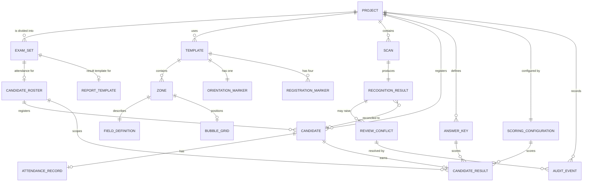

# Data model

This document describes the entities OMRFlow needs across the whole roadmap and
how they relate. It is a **design document**: most entities are not implemented
yet, and each one is marked with the phase that introduces it.

Implementing an entity early, "because we will need it anyway", is explicitly
discouraged - a speculative column is a column nobody knows the rules for. What
this document guarantees instead is that when a phase does implement its
entities, it finds the intended shape and relationships already agreed.

## Status summary

| Entity | Status | Storage |
|---|---|---|
| Project | Implemented (Phase 0) | `project.json` + `project_setting` table |
| ExamSet (the project's own registry of sets) | Implemented (project configuration) | `project_set` table |
| Per-Set attendance (a roster belongs to one set) | Implemented (per-set attendance) | `candidate_roster.set_id` |
| Per-Set result template | Implemented (per-set attendance) | `report_template_association.set_id` / `source_kind` |
| Template, Zone, FieldDefinition, RegistrationMarker, OrientationMarker, BubbleGrid, RecognitionSettings | Implemented (Phase 0) | `.omrt` document |
| ScanBatch | Implemented (Phase 5) | `scan_batch` table |
| BatchScan (one scan in a batch) | Implemented (Phase 5) | `batch_scan` table |
| RecognitionResult | Implemented (Phase 5) | `batch_scan.result_json` |
| FieldValue (per-zone, as its own row) | **Not implemented — superseded** (Phase 6) | — |
| ReviewConflict (was RecognitionConflict) | Implemented (Phase 6) | `review_conflict` table |
| AuditEvent | Implemented (Phase 6) | `audit_event` table |
| Provenance / effective value | Implemented (Phase 6) | *projected*, not stored |
| CandidateRoster | Implemented (Phase 7) | `candidate_roster` table |
| RegisteredCandidate | Implemented (Phase 7) | `registered_candidate` table |
| AttendanceRecord | **Not implemented — superseded** (Phase 7) | — |
| ReconciliationRun | Implemented (Phase 7) | `reconciliation_run` table |
| CandidateReconciliation | Implemented (Phase 7) | `reconciliation_entry` + `reconciliation_script` |
| ReconciliationResolution | Implemented (Phase 7) | `reconciliation_decision` table |
| AnswerKey | Implemented (Phase 8) | `answer_key_revision` table |
| ScoringConfiguration | Implemented (Phase 8) | `scoring_policy_revision` table |
| CandidateResult | Implemented (Phase 8) | `candidate_result` table |
| Per-question breakdown | **Not stored - regenerated** (Phase 8) | - |
| ReportTemplateAssociation | Implemented (Phase 9) | `report_template_association` table |
| ReportLayoutConfig | Implemented (Phase 9) | `report_layout_config` table |
| GeneratedReport | Implemented (Phase 9) | `generated_report` table |
| BatchScanHistory (superseded reprocessing results) | Implemented (Phase 10) | `batch_scan_history` table |
| ProcessingManifest (reproducibility snapshot) | Implemented (Phase 10) | `processing_manifest` table |
| Content-hash provenance (per scan) | Implemented (Phase 10) | `batch_scan.content_sha256`/`content_hash_algorithm` columns |
| Project backup manifest | Implemented (Phase 10) | Filesystem sidecar JSON, deliberately **not** a database table - see below |

## Entity relationships



## Entities

### Project - *implemented*

An examination workspace on disk. Identity lives in `project.json`; the SQLite
database is the authoritative store for working data.

| Field | Type | Notes |
|---|---|---|
| `project_format_version` | int | Refuses to open a newer format. Currently 3. |
| `project_id` | uuid string | Stable; never regenerated. Referenced by exports. |
| `name` | str | The workspace's name, and the default folder name; validated as a portable folder name. |
| `exam_name` | str | The examination's title, as it should read on a report. Free text - it is never a path, so none of `name`'s folder-name restrictions apply. Empty only in a format-version-1 document; `Project.exam_name` then falls back to `name`. |
| `description` | str | Free text. |
| `created_at`, `modified_at` | datetime (UTC, aware) | Naive timestamps are rejected. |
| `created_with` | str | OMRFlow version, for diagnostics. |
| `active_template` | str or null | The template the project's sheets are read against, as a **project-relative POSIX path** (`templates/OMR-Scan.omrt`) so the folder stays portable. Absolute paths, `..` segments and UNC paths are rejected on load. Null in a format-version-1 or -2 document, and in a project that owns no template; a project that owns exactly one adopts it the first time it opens. Added in format version 3. |

Directory layout and rationale: `docs/decisions/ADR-0002-project-on-disk-layout.md`.

### ExamSet - *implemented*

The project's own registry of the sets one examination is divided into - a set
code as printed on the paper, and what it means. Table `project_set`.

| Field | Type | Notes |
|---|---|---|
| `set_id` | 32-char hex string | Stable identity, generated once (`uuid4().hex`, the same form `scan_batch.batch_id` uses). Never a row number, and never reissued when a code is corrected. This is what later phases should link attendance, candidates and results to. |
| `code` | str(32) | Operator-visible: `10`, `A`, `EEE-01`. Unique within the project, enforced by a constraint as well as by the service layer. Same width and same value-space as the `set_code` columns below, so the two can be joined directly. |
| `description` | text | Free text, e.g. `Name of Post: Assistant Engineer (Electrical)`. May be empty and may be long. |
| `display_order` | int | The operator's own ordering, renumbered densely from zero. |
| `created_at`, `updated_at` | datetime (UTC, aware) | |

**How this relates to the `set_code` that Phases 8 and 9 already use.**
`answer_key_revision.set_code`, `report_template_association.set_code`,
`report_layout_config.set_code`, `generated_report.set_code` and
`batch_scan.set_code_value` are all *references* to a set by the code printed
on the paper. `project_set` is the *definition* side: which codes this
examination uses, and what each one means. The code string is deliberately the
same value in both.

**No foreign key joins them yet, on purpose.** Declaring one would change how
answer keys, scoring and reports behave, which the pass that introduced this
table was explicitly scoped out of. The join is made possible here; making it
belongs to the phase that needs it.

Deletion goes through `project_sets.references_to_set`, which is the single
place a future phase declares what depends on a set. It currently returns
nothing - because nothing does - and `delete_set` consults it anyway, so that
adding those links later cannot silently start orphaning records. The database
backs this up independently: `candidate_roster.set_id` and
`report_template_association.set_id` are both `ON DELETE RESTRICT`, so
deleting a set that still has attendance imported against it fails loudly
rather than cascading an examination's candidate list away.

### How a set isolates its candidates, results and report

The relationship that does the work is **one roster per set**:

```text
project_set (set_id)
   └── candidate_roster (set_id)           one active roster per set
         ├── registered_candidate           unique per (roster_id, candidate_id)
         ├── reconciliation_run / _entry     keyed by (roster_id, batch_id)
         └── candidate_result                unique per (roster_id, batch_id, candidate_id)
```

Everything below the roster was **already** keyed by `roster_id` before this
change; giving the roster a `set_id` therefore makes candidates, reconciliation
state and stored marks belong to a set transitively, without altering a single
one of those tables. That is why roll `10001` can exist independently in Set 10
and Set 11: they are two rows in two different rosters, and the uniqueness
constraint has always been per roster, never project-wide.

The result template is resolved by `set_id` first and only then by `set_code`
(`report_store.get_template_association_for_set`), and a row matched by code
while carrying a *different* `set_id` is deliberately not returned - which is
what stops one set's workbook from ever being reached from another set's
generation.

**`set_code` is still the machine-readable key** that recognition reads off a
sheet and that answer keys, layout configuration and generated-report audit
rows use. `project_set` is the explicit mapping between that string and the
persistent `set_id`, and `project_sets.set_by_code` is the one place the
translation happens - rather than string matching spread through the
application.

### Template and its parts - *implemented*

Fully specified in `docs/TEMPLATE_FORMAT.md`. Summary of the relationships:

- a **Template** owns exactly four **RegistrationMarkers** (one per corner role),
  exactly one **OrientationMarker**, any number of **Zones**, and one default
  **RecognitionSettings**;
- a **Zone** has bounds, one **FieldDefinition** (numeric, alphanumeric, set
  code, question block or ignored), an optional per-zone **RecognitionSettings**
  override, and - unless it is ignored - a **BubbleGrid**;
- a **BubbleGrid** stores an origin plus row/column pitch, with optional explicit
  overrides for irregular cells.

Templates are versioned documents, not database rows, so that a sheet design can
be shared between projects and reviewed in version control.

### ScanBatch - *implemented (Phase 5)*

One run over a folder of scans. Table `scan_batch`.

Fields: `batch_id` (UUID hex), `created_at`, `updated_at`, `source_folder`,
`template_id`, `template_name`, `template_path`, `geometry_fingerprint`,
`recognition_fingerprint`, `engine_version`, `settings_json`, `status`,
`total_scans`.

`status` is one of `new`, `running`, `interrupted`, `cancelled`, `completed`,
`completed_with_errors`. The last two are deliberately distinct: "the loop
finished" and "the work succeeded" are different claims, and only the second
may be reported as success.

The two fingerprints are why resume can refuse to mix results. They are the
same hashes `OmrTemplate` computes for Phase 4's calibration staleness check,
so a template edited between two halves of a batch is detected by the same
mechanism in both places.

### BatchScan - *implemented (Phase 5)*

One scanned sheet inside a batch. Table `batch_scan`, unique on
`(batch_id, source_path)`.

Fields: `scan_id`, `batch_id`, `batch_index`, `source_path`, `filename`,
`file_size`, `modified_at`, `status`, `attempt_count`, `outcome`,
`registration`, `identifier_value`, `set_code_value`, `output_name`,
`output_path`, `copied`, `error_code`, `error_category`, `error_message`,
`result_json`, `started_at`, `finished_at`, `duration_seconds`.

`status` is one of `pending`, `queued`, `processing`, `completed`, `warning`,
`failed`, `cancelled`. Every state is either *terminal* (work a resume must
keep) or *resumable*; a test asserts that no state is somehow neither, because
a scan in such a state would be invisible to both the resume query and the
completed count.

Invariants:
- **original scans are never modified or moved** - only the path is stored, so
  importing a folder does not duplicate gigabytes of images. Asserted by a
  hash-before/hash-after test.
- `batch_index` is the enumeration order and never changes, because it is what
  a resumed run replays - and therefore what decides which of two sheets
  sharing a roll number keeps the plain output name.
- `file_size` and `modified_at` record what the file looked like when it was
  enumerated. Cheap, and enough to notice a source replaced between runs;
  hashing every scan would read the whole batch twice for a check that almost
  never fires.

### RecognitionResult - *implemented (Phase 5)*

Stored as JSON in `batch_scan.result_json`, via
`ScanResult.to_dict()`/`from_dict()`.

Deliberately *not* exploded into typed columns: that serialisation is already a
versioned, round-tripping contract with its own schema version, and duplicating
its forty-odd fields as columns would mean a migration every time recognition
gained a measurement. The handful of columns that *are* typed alongside it are
exactly the ones a query needs to filter or sort on without decoding every row.

### FieldValue - *not implemented; superseded in Phase 6*

Planned as one row per recognised zone, for a conflict queue to point at. Phase
6 did not build it, and the reason is worth recording.

Every recognised field already exists, structured and versioned, inside
`batch_scan.result_json`. A parallel `field_value` table would have been a
**second copy of the same values**, kept in step by application code — and the
one defect this phase most had to avoid is an interface that shows a value
different from the one the engine produced. Two stores is precisely how that
happens.

So a conflict **references** a field rather than duplicating it:
`(zone_id, group_key)` addresses a group in the stored result, resolved through
`recognition/fields.py`, which is the same mapping recognition itself used. The
machine's reading is snapshotted onto the conflict row for querying and display,
but the result remains the single source of what was recognised.

The invariant the original design was protecting is kept in full, and is
enforced harder than a separate table would have managed: **the machine value is
never overwritten**, and a human correction is a new `audit_event` row that a
trigger forbids anyone from rewriting.

If a later phase needs per-field rows for scoring or reporting, it should
derive them from the stored result rather than have recognition write to two
places.

### ReviewConflict - *implemented (Phase 6)*

One thing on one sheet that a person needs to look at. Table `review_conflict`.

Fields: `conflict_id`, `batch_id`, `scan_id`, `conflict_type`, `scope`,
`zone_id`, `group_key`, `field_kind`, `field_label`, `question_number`,
`machine_value`, `machine_status`, `machine_confidence`, `machine_detail`,
`state`, `detected_at`, `updated_at`.

Identity is `(batch_id, scan_id, conflict_type, zone_id, group_key)`, enforced
by the unique constraint `review_conflict_identity`. That is what makes
detection **idempotent**: re-running, resuming or retrying a batch updates the
existing conflicts instead of creating a second set. Two indexes support the
queue — `(batch_id, state)` for filtering and counting, `(scan_id)` for a
sheet's own conflicts.

`conflict_type` is one of 22 values (`omr_scanner.domain.review.ConflictType`),
`state` one of `open` / `resolved` / `deferred` / `withdrawn`.

Invariants:
- the `machine_*` columns are written at detection and changed **only** by a
  re-read, which appends a `re_recognised` audit event first. No human action
  touches them.
- `state` is a **cache**, not the truth. The authoritative state is the fold
  over that conflict's audit events; `recompute_state` rebuilds the column from
  them, and a test asserts the two agree.
- conflicts are **never deleted**. One the machine no longer raises becomes
  `withdrawn`; the fact that it was once disputed is evidence.
- a machine re-read may withdraw its own complaint but **never** overrides a
  state a person set.

### Provenance and the effective value - *implemented (Phase 6); not stored*

There is no `resolved_value` column, deliberately. The final value of a field is
**projected** by `review_store.provenance_for` as a left-fold over that
conflict's audit events in order, starting from the machine's reading.

A stored resolved value would be a third copy of the truth, and would have to be
kept correct across corrections, reopenings and re-corrections by application
code. The fold cannot drift, because there is nothing to drift *from*: the
events are the record, and one function reads them.

`Provenance` carries the effective value, its source (`machine` / `human`), the
machine value, the reviewer, the reason, the timestamp and the originating event
— everything the traceability requirement asks for, all derived.

### CandidateRoster and RegisteredCandidate - *implemented (Phase 7)*

`candidate_roster` is one import: `roster_id`, `created_at`, `source_name`,
`source_sheet`, `source_format`, `column_map`, `rows_read`, `candidate_count`,
`expected_present`, `expected_absent`, `attendance_unknown`,
`has_attendance_column`, `is_active`, `imported_by`.

`registered_candidate` is one candidate exactly as the file declared them:
`candidate_row_id`, `roster_id`, `candidate_id`, `display_name`, `row_order`,
`source_row`, `imported_attendance`, `imported_value`. Unique on
`(roster_id, candidate_id)`, which is what makes a duplicate ID impossible to
store even if validation were bypassed, and is the index scripts are matched
through.

Invariants:
- **`registered_candidate` is write-once.** Nothing in the application updates
  a row after import. An operator who establishes that a candidate recorded
  absent actually attended creates a `reconciliation_decision` beside it; the
  entry then reports both values. That separation is the only reason this table
  exists rather than a mutable "candidate" table.
- `imported_value` keeps the **raw cell**, so an operator can see that the
  sheet said `abs` rather than `ABSENT`.
- Only `source_name` is stored, never the source path: a project database is
  shared, and a path can name somebody's home directory. The file itself is
  never modified, moved or copied in.
- Several rosters may exist; exactly one `is_active`. A re-import supersedes
  rather than merges, and the superseded roster is kept because decisions were
  taken against it.

Privacy: candidate names and IDs are project data. They must not appear in
logs, in bug reports or in committed fixtures. See
[`reconciliation.md`](reconciliation.md) §9.

### AttendanceRecord - *not implemented; superseded in Phase 7*

Planned as a separate row recording a declared `present`/`absent` state with a
source and a timestamp. Phase 7 did not build it.

The imported state is an attribute of the roster row
(`registered_candidate.imported_attendance`), written once and never touched. A
human override is a `reconciliation_decision`, and every change is already in
`audit_event` with its actor, reason and timestamp. A third table holding "the
attendance state" would have been a place for those two to disagree, and the
only thing it would have added is a second answer to a question that must have
one.

### ReconciliationRun - *implemented (Phase 7)*

`run_id`, `roster_id`, `batch_id`, `created_at`, `updated_at`, `counts` (JSON).
Unique on `(roster_id, batch_id)` - **one row per pair, updated in place**. A
row per *run* would grow without bound and, worse, leave yesterday's
classifications in the database looking current.

### ReconciliationEntry and ReconciliationScript - *implemented (Phase 7)*

`reconciliation_entry` is one candidate's state, or one group of scripts that
belong to no registered candidate: `entry_id`, `roster_id`, `batch_id`,
`entry_key`, `entry_order`, `candidate_row_id` (null for an unplaced script),
`candidate_id`, `display_name`, `is_registered`, `status`, `issues`,
`script_count`, `excluded_count`, `imported_attendance`,
`effective_attendance`, `attendance_source`, `resolution`, `reason_code`,
`reason_text`, `reviewer`, `updated_at`.

`reconciliation_script` is the link between one scan and the entry it was filed
under: `link_id`, `roster_id`, `batch_id`, `entry_id`, `scan_id`,
`source_name`, `machine_candidate_id`, `effective_candidate_id`,
`assigned_candidate_id`, `assignment`, `identifier_unresolved`, `excluded`,
`is_primary`, `reason_code`, `reason_text`, `reviewer`, `updated_at`.

Invariants:
- **Both tables are a cache of a pure function.**
  `services.reconciliation.reconcile()` recomputes every column from the
  roster, the scripts and the standing decisions, and `reconcile_batch`
  rewrites them wholesale. They are stored so a ten-thousand-candidate cohort
  can be filtered, counted and paged in SQL rather than in Python.
- **One `reconciliation_script` row per scan in the batch, always** - including
  a script belonging to nobody and one an operator has set aside. A script
  missing from this table would be missing from every count and every screen,
  which is the one thing this phase forbids.
- `issues` is a comma-separated **set**, not a single status, because the
  conditions genuinely co-occur. A schema holding one would make a physical
  script invisible.
- `machine_candidate_id` is never overwritten by a human assignment;
  `assigned_candidate_id` records that separately.

### ReconciliationDecision - *implemented (Phase 7)*

`decision_id`, `roster_id`, `batch_id`, `target_kind` (`script`/`candidate`),
`target_key`, `assigned_candidate_id`, `attendance_override`, `excluded`,
`is_primary`, `dismissed`, `reason_code`, `reason_text`, `reviewer`,
`decided_at`, `updated_at`. Unique on
`(roster_id, batch_id, target_kind, target_key)`.

The **input** to reconciliation, not an output - which is why it lives apart
from the two tables above, whose every column is disposable. Re-running
recomputes every classification from scratch and these rows are what steer it.

A decision is a *current* position; its history is in `audit_event`, appended in
the same transaction and never rewritten.

### AnswerKeyRevision - *implemented (Phase 8)*

One question-paper set's key, at one revision. Table `answer_key_revision`,
unique on `(set_code, revision)`.

Fields: `key_id`, `set_code`, `revision`, `answers`, `wrong_questions`,
`first_question`, `question_count`, `status`, `source`, `source_scan`, `notes`,
`created_at`, `verified_at`, `verified_by`.

`answers` is one character per question - the canonical form described in
[`scoring.md`](scoring.md) §2 - with no blanks and no multiples: a key gives
exactly one correct choice per question.

Invariants:
- **A revision is never edited.** Correcting a verified key creates revision
  *n+1* and supersedes the old one; the old row stays, because a
  `CandidateResult` points at it and "which key produced this mark" must always
  have an answer.
- `status` is `draft` / `verified` / `superseded`. **Only `verified` produces
  marks.** Recognition completing on a solution sheet does not make a key
  right, so a scanned key arrives as a draft like any other.
- `wrong_questions` lives on the *revision* rather than beside the set, because
  withdrawing a question changes every mark for that set. It is part of the key,
  not a separate setting that could drift out of step with it.
- Revision numbering is owned by the store, not the caller, so two operators
  cannot both create "revision 2".
- `set_code` is not assumed to be one character.

### ScoringPolicyRevision - *implemented (Phase 8)*

The marking rules, at one revision. Table `scoring_policy_revision`.

Fields: `policy_id`, `revision`, `correct_mark`, `blank_mark`,
`incorrect_penalty`, `multiple_penalty`, `mode`, `clamp_minimum`,
`minimum_score`, `is_active`, `created_at`, `created_by`.

Invariants:
- **Every mark is stored as an exact rational string** - `"1"`, `"1/4"`,
  `"-1/3"` - and read back with `fractions.Fraction`. A `FLOAT` column would
  make a stored policy round-trip to something a fraction of a mark away from
  what the operator typed, which is precisely what this phase forbids.
- **Penalties are positive magnitudes** and are subtracted. A column that
  accepted both signs would eventually be given the wrong one, and the paper
  would be marked generously by half.
- A new revision is created only when a score-affecting rule actually changes;
  saving an unchanged policy is a no-op. Creating a revision per click would
  make every result stale for no reason, and "stale" has to mean something.
- `clamp_minimum` is *recorded*, not hard-coded, so a result can say whether it
  was clamped rather than leaving it to be inferred.

### CandidateResult - *implemented (Phase 8)*

One candidate's mark, and everything needed to reproduce it. Table
`candidate_result`, unique on `(roster_id, batch_id, candidate_id)`.

The **authoritative inputs**: `answer_string`, `machine_answer_string`,
`corrected_questions`, `set_code`, `answer_key_id`, `answer_key_revision`,
`policy_id`, `policy_revision`, `first_question`, `scan_id`.

The **derived** columns: `question_count`, `correct_count`, `incorrect_count`,
`blank_count`, `multiple_count`, `wrong_question_count`, `raw_score`,
`final_score`, `clamped`, `status`, `blocks`.

Invariants:
- **`answer_key_id` and `answer_key_revision` are the provenance the phase
  turns on.** A result identifies the exact revisions used, so a later key does
  not retroactively change what an earlier mark was computed from. Historical
  key usage is never inferred from whichever key is current.
- **The derived columns are recomputed, never patched.** Changing a rule runs
  the scorer again over the stored inputs; nothing adds a delta to an existing
  mark. A test asserts this by corrupting a stored score and checking the
  rescore produces the correct value rather than the corrupted one adjusted.
- `raw_score` and `final_score` are exact rational strings. A displayed mark is
  that value formatted, and the formatting never feeds back.
- `status` is `scored` / `absent` / `blocked`. **An absent candidate has no
  mark, not a mark of zero** - zero would be indistinguishable from somebody
  who sat the paper and answered nothing.
- `machine_answer_string` keeps what recognition alone read, beside the
  effective string, so a correction never costs the record of what it changed
  from.

### The per-question breakdown - *not stored; regenerated*

A hundred questions across ten thousand candidates is a million rows that would
have to be kept in step with a total they could contradict.

Instead `CandidateResult` keeps its inputs and
`scoring_store.breakdown_for()` reruns the same pure function that produced the
mark. A detail view and a total can then never disagree, because there is only
one calculation - and the phase's reproducibility requirement is satisfied by
construction rather than by keeping two things in sync.

### ReportTemplateAssociation - *implemented (Phase 9)*

Which result/absentee workbook an operator selected for one set, and its
column mapping. Table `report_template_association`, unique on `set_code`.

**One row per set, updated in place** rather than revisioned - unlike an
answer key or scoring policy, selecting a different template is not
score-affecting; it changes presentation, not what a candidate is worth. What
must remain reproducible per generation - the template path, its SHA-256 hash
at that moment - is captured on `GeneratedReport` instead, so a filed report
stays traceable even after the association has since changed.

Fields: `template_path`, `template_sha256`, `sheet_name`, `roll_column`,
`marks_column`, `serial_column`, `name_column`, `rank_column`.

### ReportLayoutConfig - *implemented (Phase 9)*

Header/subtitle/footer text, logo, fonts and page setup. Table
`report_layout_config`. `set_code=""` is the project-wide default; a real set
code is a per-set override, looked up first and falling back to the default
row.

Every field left at its class default means "preserve the template exactly as
supplied" - layout only ever *supplements* what a template does not already
define.

### GeneratedReport - *implemented (Phase 9)*

One report-generation attempt, and everything it was computed from. Table
`generated_report`, **append-only** - a new generation writes a new row rather
than editing the last one for that set, the same rule Phase 8's key and policy
revisions follow.

Fields: `set_code`, `report_type` (`xlsx` / `pdf_rollwise` / `pdf_meritwise`),
`template_path`, `template_sha256`, `answer_key_revision`, `policy_revision`,
`layout_config_snapshot_json`, `candidate_count`/`present_count`/
`absent_count`/`scored_count`/`unresolved_count`, `warnings_json`,
`output_path`, `output_sha256`, `status`, `error_message`, `generated_at`,
`generated_by`, `application_version`.

Deliberately holds no candidate data - counts, revisions and hashes only. The
generated workbook on disk, at `output_path`, is where the candidate
information lives; this row exists to make that file traceable to its inputs,
not to duplicate it.

### AuditEvent - *implemented (Phase 6)*

Append-only history of anything that can change a result. Table `audit_event`.

Fields: `event_id`, `occurred_at`, `entity_type`, `entity_id`, `batch_id`,
`scan_id`, `conflict_id`, `action`, `reviewer`, `previous_value`, `new_value`,
`machine_value`, `reason_code`, `reason_text`, `detail`.

`entity_type` and `entity_id` were added by **migration 4** (Phase 7), so the
same ledger can record decisions about candidates and scripts as well as
conflicts. Rows written before that migration read back as
`entity_type='conflict'`, `entity_id=0`; their `conflict_id` still identifies
them, and it is what a conflict's history is queried by, so nothing had to be
rewritten. **Deliberately no backfill** — an `UPDATE` would have been aborted by
the immutability triggers, which is exactly the behaviour those triggers exist
for.

Append-only is the whole point: rows are never updated or deleted, so the
question "why does this candidate have this mark?" always has an answer.
Enforced at three levels — no update or delete on the service surface, none
anywhere in the application, and two SQLite triggers that abort either one
outright. See [`conflict_review.md`](conflict_review.md) §7.

**No foreign key**, deliberately. A conflict row may one day be removed by
housekeeping; the record that a named person decided something must outlive it.
That is also what let Phase 7 start auditing candidates and scripts here without
touching a constraint.

`action` for a conflict is one of `detected`, `re_recognised`, `accepted`,
`corrected`, `deferred`, `reopened`, `withdrawn`. The first two are the
machine's; the rest require a named reviewer, and `corrected` additionally
requires a reason. Phase 7 adds its own actions under `entity_type` of
`candidate` or `script` — see [`reconciliation.md`](reconciliation.md).

## Persistence strategy

| Table | Purpose | Added by |
|---|---|---|
| `schema_migration` | Ledger of applied migrations: version, description, timestamp, writing application version. | Phase 0 (migration 1) |
| `project_setting` | Key/value mirror of project identity, so a stray `database.sqlite` can still be identified. | Phase 0 (migration 1) |
| `scan_batch` | One run over a folder of scans. | Phase 5 (migration 2) |
| `batch_scan` | One scanned sheet inside a batch, with its stored result. | Phase 5 (migration 2) |
| `review_conflict` | One thing on one sheet a person must look at. | Phase 6 (migration 3) |
| `audit_event` | Append-only history of every decision. | Phase 6 (migration 3); entity columns Phase 7 (migration 4) |
| `candidate_roster` | One imported candidate/attendance list. | Phase 7 (migration 4) |
| `registered_candidate` | One candidate as the file declared them. | Phase 7 (migration 4) |
| `reconciliation_run` | When a roster/batch pair was last reconciled. | Phase 7 (migration 4) |
| `reconciliation_entry` | One candidate's reconciliation state. | Phase 7 (migration 4) |
| `reconciliation_script` | One scan, and the entry it was filed under. | Phase 7 (migration 4) |
| `reconciliation_decision` | An operator's standing decision. | Phase 7 (migration 4) |
| `answer_key_revision` | One set's key, at one revision. | Phase 8 (migration 5) |
| `scoring_policy_revision` | The marking rules, at one revision. | Phase 8 (migration 5) |
| `candidate_result` | One candidate's mark and its inputs. | Phase 8 (migration 5) |
| `report_template_association` | One set's chosen result template and column mapping. | Phase 9 (migration 6) |
| `report_layout_config` | Header/logo/font/page-setup configuration, project or per-set. | Phase 9 (migration 6) |
| `generated_report` | One report-generation attempt and its provenance. | Phase 9 (migration 6) |
| `batch_scan_history` | A scan's superseded status/outcome/result, archived before reprocessing. Append-only, trigger-enforced, like `audit_event`. | Phase 10 (migration 7) |
| `processing_manifest` | A reproducibility snapshot, assembled from Phases 5-9's own tables rather than duplicating them. | Phase 10 (migration 7) |
| `project_set` | The project's own registry of examination sets: code, description, order, stable id. | Project configuration (migration 8) |
| `candidate_roster.set_id` | Which set an attendance list belongs to. NULL for a roster imported before attendance was per-set. | Per-set attendance (migration 9) |
| `report_template_association.set_id` / `source_kind` | Which set a result template belongs to, and whether it arrived as that set's attendance workbook. | Per-set attendance (migration 9) |

### Schema version 9 (per-set attendance and templates)

`_migration_009_per_set_attendance` adds two nullable columns and one index.
Purely additive, and deliberately **not** backfilled.

- **An existing roster keeps `set_id` NULL.** A project processed before this
  version has exactly one roster for the whole examination, and nothing in the
  data says which of several later-defined sets it was meant to be. Guessing
  would attach one set's candidate list to another set's report - the precise
  failure this work exists to prevent. The roster is therefore left
  *unassigned*, reported as such by
  `reconciliation_store.unassigned_rosters`, and attached to a set only by an
  operator, through `assign_roster_to_set` (§29's "explicit user resolution").
- **A template association that predates the set registry keeps `set_id`
  NULL** too. Its `set_code` still resolves it for every existing Phase 9
  path, and `set_id` is filled in the next time a template is associated for a
  set with that code.
- **`source_kind` defaults to `'manual'`**, which is what every pre-existing
  association genuinely was: chosen by an operator, not derived from an
  attendance import.
- **An old single-set project keeps working**: with no sets defined, the
  unscoped roster is still found by `active_roster(database)` (no set
  argument), and `generate_xlsx` without a `set_id` behaves exactly as before.

### Schema version 8 (project configuration)

`_migration_008_project_sets` creates `project_set`. Purely additive, and
deliberately **not** backfilled.

- **A project created before this version opens normally** and starts with an
  empty set list, which the operator fills in from *File -> Project
  Configuration...*.
- **Nothing is inferred from existing data.** The set codes an older project
  already contains (`answer_key_revision.set_code`,
  `batch_scan.set_code_value`) record what *happened* - a key that was
  entered, a code recognition read off a sheet - not which sets the
  examination was *meant* to have. A set whose papers were never scanned would
  simply be missing, and nothing in the data says so, so inventing registry
  entries from them would be the application asserting something it cannot
  know. `project_sets.suggest_sets_from_existing_data` exists so the interface
  can *offer* those codes as a starting point; accepting them is the
  operator's decision.
- **`project.json` format version 1 -> 2.** Reading is backward compatible: a
  version 1 document has no `exam_name` and loads with an empty one, and
  `Project.exam_name` falls back to `name` so every caller has something
  truthful to show. The stored version stays at 1 until something is actually
  written; setting an examination name rewrites the document as version 2.
  The bump exists because `ProjectMetadata` forbids unknown fields, so an
  *older* build handed a version 2 document would otherwise reject it as
  corrupt rather than saying "this project was created with a newer version of
  OMRFlow".
- **`project.json` format version 2 -> 3.** Adds `active_template`, the
  project's template as a project-relative POSIX path. Reading stays backward
  compatible: an older document has no such field and loads with `None`, and a
  project that owns exactly one template adopts it the first time it opens, so
  the upgrade costs the operator nothing. The bump exists for the same reason
  the last one did - unknown fields are forbidden, so an older build must be
  told the document is newer rather than left to call it corrupt.

### Schema version 3 (Phase 6)

`_migration_003_review_and_audit` creates `review_conflict` and `audit_event`,
their indexes and unique constraint, and the two `BEFORE UPDATE` /
`BEFORE DELETE ... RAISE(ABORT)` triggers that make `audit_event` append-only at
the database level.

Compatibility, both directions:

- **A project created before Phase 6 opens normally.** Migrations are
  forward-only and run on open, so a version-2 database gains the two tables
  with no conflicts in them; an existing batch simply has nothing to review
  until it is looked at again.
- **Its existing results are not merely preserved but usable.** Conflicts are
  detected from the *stored* recognition results, so a batch processed under
  Phase 5 becomes fully reviewable without re-reading a single image.
- **No existing table or column was altered.** Phase 6 is purely additive, so
  Phases 0-5 read and write exactly what they did before.
- **A version-3 database cannot be opened by an older build** — the standard
  refusal, unchanged since Phase 0.

All four are asserted by
`TestMigrationOntoAnExistingProject`, which winds a *real* project back to
version 2 — dropping both tables, both triggers and the ledger row — then
reopens it and checks that the Phase 5 batch survived intact, the tables
returned, the conflicts came back from the stored results, and the re-created
ledger refuses a `DELETE` again.

The triggers are created with `IF NOT EXISTS`, so re-running a partially applied
migration is safe. They are *not* re-asserted on every open: a database whose
triggers were dropped while its schema version was left at 3 keeps the tables
but loses the database-level enforcement. That is a deliberate database
administrator action, which §7 of [`conflict_review.md`](conflict_review.md)
already places outside what the application undertakes to prevent.

### Schema version 4 (Phase 7)

`_migration_004_reconciliation` creates the six reconciliation tables, and adds
`entity_type` and `entity_id` to `audit_event` so a decision about a candidate
or a script is recorded in the **same append-only ledger**, under the same
triggers, as a decision about a recognition conflict — rather than in a second
history table with its own, weaker guarantees.

Compatibility:

- **Purely additive.** No existing table or column was altered, so Phases 0-6
  read and write exactly what they did before.
- **Existing audit rows were deliberately not backfilled.** `ADD COLUMN` is a
  schema change and does not fire the immutability triggers; an `UPDATE` to
  populate the new columns *would*, and rightly so. The column default
  (`'conflict'`) is therefore chosen to be already correct for every row that
  predates this migration, and a conflict's history is still queried by
  `conflict_id` exactly as before. Nothing had to be rewritten, so nothing was.
- **A project processed before Phase 7 opens normally** and simply has no
  roster until one is imported.

Asserted by `TestMigrationOntoAnExistingPhase6Project`, which winds a real
project back to version 3 — dropping the six tables and both new columns — then
reopens it and checks the conflicts and the ledger survived, the columns
returned with the right default, and the ledger still refuses a `DELETE`.

### Schema version 5 (Phase 8)

`_migration_005_scoring` creates `answer_key_revision`,
`scoring_policy_revision` and `candidate_result`. Purely additive: no existing
table or column was altered, and there is nothing to convert, because this is
the first phase that produces marks at all.

A project reconciled before Phase 8 opens normally and simply has no keys until
one is written. Asserted by
`TestMigrationOntoAnExistingPhase7Project`, which winds a real project back to
version 4, reopens it, and checks the roster survived and a key can then be
stored.

Key/value storage is appropriate for a handful of identity attributes. Data that
is queried, joined, sorted or reported on - scans, candidates, results - gets
properly typed tables in the phase that introduces it. Do not extend
`project_setting` into a general-purpose object store.

### Schema version 6 (Phase 9)

`_migration_006_reporting` creates `report_template_association`,
`report_layout_config` and `generated_report`. Purely additive, following
migration 5's own precedent exactly: a project scored before this version has
never been reported on, so nothing needs converting.

A project scored before Phase 9 opens normally and simply has no template
association or generated reports until one is created. Asserted the same way
migration 5 was: a real project wound back to version 5, reopened, and checked
its Phase 8 data survived and a template can then be associated.

### Schema version 7 (Phase 10)

`_migration_007_production_hardening` adds `content_sha256` and
`content_hash_algorithm` columns to `batch_scan` (via `ALTER TABLE ADD
COLUMN`, following migration 4's own precedent for adding columns to an
existing table), and creates `batch_scan_history` and `processing_manifest`,
plus `batch_scan_history`'s two append-only triggers.

Existing rows are **left at the column defaults** (`''`/`'sha256'`) rather
than backfilled: hashing a scan already on disk means reading it again, and
a project upgraded from an earlier schema version is simply re-hashed the
next time it is opened for reprocessing or a health check, rather than
paying that cost for every project the moment it upgrades.

A project processed before Phase 10 opens normally, gains the two new
tables and columns with no reprocessing history and no content hashes yet,
and every earlier phase's data is untouched - asserted by
`TestMigrationOntoAnExistingPhase9Project`, which winds a real project back
to version 6, drops both new tables, reopens it, and checks the tables
return and the append-only triggers refuse an `UPDATE` and a `DELETE`
against a freshly inserted row.

Backups (`services.project_backup`) are deliberately **not** a database
table. A backup's manifest lives beside it on disk as a sidecar JSON file,
written only after the backup itself finishes and is hashed - so a backup
of a database that is itself damaged can still be found and read from the
filesystem, and so an incomplete backup (a `.sqlite3` file with no
manifest) can never be recorded as complete by the very database it might
be a backup *of*.

Each phase adds its tables together with a migration; see
`docs/DEVELOPMENT_GUIDE.md`.
