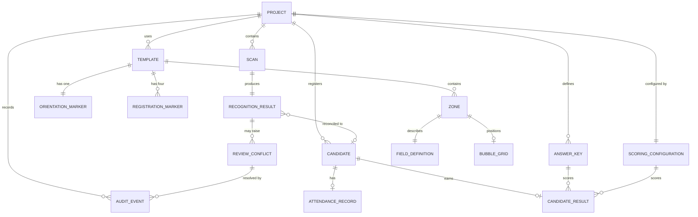

# Data model

This document describes the entities OMRFlow needs across the whole roadmap and
how they relate. It is a **design document**: most entities are not implemented
yet, and each one is marked with the phase that introduces it.

Implementing an entity early, "because we will need it anyway", is explicitly
discouraged - a speculative column is a column nobody knows the rules for. What
this document guarantees instead is that when a phase does implement its
entities, it finds the intended shape and relationships already agreed.

## Status summary

| Entity | Status | Storage |
|---|---|---|
| Project | Implemented (Phase 0) | `project.json` + `project_setting` table |
| Template, Zone, FieldDefinition, RegistrationMarker, OrientationMarker, BubbleGrid, RecognitionSettings | Implemented (Phase 0) | `.omrt` document |
| ScanBatch | Implemented (Phase 5) | `scan_batch` table |
| BatchScan (one scan in a batch) | Implemented (Phase 5) | `batch_scan` table |
| RecognitionResult | Implemented (Phase 5) | `batch_scan.result_json` |
| FieldValue (per-zone, as its own row) | **Not implemented — superseded** (Phase 6) | — |
| ReviewConflict (was RecognitionConflict) | Implemented (Phase 6) | `review_conflict` table |
| AuditEvent | Implemented (Phase 6) | `audit_event` table |
| Provenance / effective value | Implemented (Phase 6) | *projected*, not stored |
| Candidate, AttendanceRecord | Planned (Phase 7) | database |
| AnswerKey | Planned (Phase 8) | database |
| ScoringConfiguration | Planned (Phase 8) | database |
| CandidateResult | Planned (Phase 8/9) | database |

## Entity relationships

## Entities

### Project - *implemented*

An examination workspace on disk. Identity lives in `project.json`; the SQLite
database is the authoritative store for working data.

| Field | Type | Notes |
|---|---|---|
| `project_format_version` | int | Refuses to open a newer format. |
| `project_id` | uuid string | Stable; never regenerated. Referenced by exports. |
| `name` | str | Also the default folder name; validated as a portable folder name. |
| `description` | str | Free text. |
| `created_at`, `modified_at` | datetime (UTC, aware) | Naive timestamps are rejected. |
| `created_with` | str | OMRFlow version, for diagnostics. |

Directory layout and rationale: `docs/decisions/ADR-0002-project-on-disk-layout.md`.

### Template and its parts - *implemented*

Fully specified in `docs/TEMPLATE_FORMAT.md`. Summary of the relationships:

- a **Template** owns exactly four **RegistrationMarkers** (one per corner role),
  exactly one **OrientationMarker**, any number of **Zones**, and one default
  **RecognitionSettings**;
- a **Zone** has bounds, one **FieldDefinition** (numeric, alphanumeric, set
  code, question block or ignored), an optional per-zone **RecognitionSettings**
  override, and - unless it is ignored - a **BubbleGrid**;
- a **BubbleGrid** stores an origin plus row/column pitch, with optional explicit
  overrides for irregular cells.

Templates are versioned documents, not database rows, so that a sheet design can
be shared between projects and reviewed in version control.

### ScanBatch - *implemented (Phase 5)*

One run over a folder of scans. Table `scan_batch`.

Fields: `batch_id` (UUID hex), `created_at`, `updated_at`, `source_folder`,
`template_id`, `template_name`, `template_path`, `geometry_fingerprint`,
`recognition_fingerprint`, `engine_version`, `settings_json`, `status`,
`total_scans`.

`status` is one of `new`, `running`, `interrupted`, `cancelled`, `completed`,
`completed_with_errors`. The last two are deliberately distinct: "the loop
finished" and "the work succeeded" are different claims, and only the second
may be reported as success.

The two fingerprints are why resume can refuse to mix results. They are the
same hashes `OmrTemplate` computes for Phase 4's calibration staleness check,
so a template edited between two halves of a batch is detected by the same
mechanism in both places.

### BatchScan - *implemented (Phase 5)*

One scanned sheet inside a batch. Table `batch_scan`, unique on
`(batch_id, source_path)`.

Fields: `scan_id`, `batch_id`, `batch_index`, `source_path`, `filename`,
`file_size`, `modified_at`, `status`, `attempt_count`, `outcome`,
`registration`, `identifier_value`, `set_code_value`, `output_name`,
`output_path`, `copied`, `error_code`, `error_category`, `error_message`,
`result_json`, `started_at`, `finished_at`, `duration_seconds`.

`status` is one of `pending`, `queued`, `processing`, `completed`, `warning`,
`failed`, `cancelled`. Every state is either *terminal* (work a resume must
keep) or *resumable*; a test asserts that no state is somehow neither, because
a scan in such a state would be invisible to both the resume query and the
completed count.

Invariants:
- **original scans are never modified or moved** - only the path is stored, so
  importing a folder does not duplicate gigabytes of images. Asserted by a
  hash-before/hash-after test.
- `batch_index` is the enumeration order and never changes, because it is what
  a resumed run replays - and therefore what decides which of two sheets
  sharing a roll number keeps the plain output name.
- `file_size` and `modified_at` record what the file looked like when it was
  enumerated. Cheap, and enough to notice a source replaced between runs;
  hashing every scan would read the whole batch twice for a check that almost
  never fires.

### RecognitionResult - *implemented (Phase 5)*

Stored as JSON in `batch_scan.result_json`, via
`ScanResult.to_dict()`/`from_dict()`.

Deliberately *not* exploded into typed columns: that serialisation is already a
versioned, round-tripping contract with its own schema version, and duplicating
its forty-odd fields as columns would mean a migration every time recognition
gained a measurement. The handful of columns that *are* typed alongside it are
exactly the ones a query needs to filter or sort on without decoding every row.

### FieldValue - *not implemented; superseded in Phase 6*

Planned as one row per recognised zone, for a conflict queue to point at. Phase
6 did not build it, and the reason is worth recording.

Every recognised field already exists, structured and versioned, inside
`batch_scan.result_json`. A parallel `field_value` table would have been a
**second copy of the same values**, kept in step by application code — and the
one defect this phase most had to avoid is an interface that shows a value
different from the one the engine produced. Two stores is precisely how that
happens.

So a conflict **references** a field rather than duplicating it:
`(zone_id, group_key)` addresses a group in the stored result, resolved through
`recognition/fields.py`, which is the same mapping recognition itself used. The
machine's reading is snapshotted onto the conflict row for querying and display,
but the result remains the single source of what was recognised.

The invariant the original design was protecting is kept in full, and is
enforced harder than a separate table would have managed: **the machine value is
never overwritten**, and a human correction is a new `audit_event` row that a
trigger forbids anyone from rewriting.

If a later phase needs per-field rows for scoring or reporting, it should
derive them from the stored result rather than have recognition write to two
places.

### ReviewConflict - *implemented (Phase 6)*

One thing on one sheet that a person needs to look at. Table `review_conflict`.

Fields: `conflict_id`, `batch_id`, `scan_id`, `conflict_type`, `scope`,
`zone_id`, `group_key`, `field_kind`, `field_label`, `question_number`,
`machine_value`, `machine_status`, `machine_confidence`, `machine_detail`,
`state`, `detected_at`, `updated_at`.

Identity is `(batch_id, scan_id, conflict_type, zone_id, group_key)`, enforced
by the unique constraint `review_conflict_identity`. That is what makes
detection **idempotent**: re-running, resuming or retrying a batch updates the
existing conflicts instead of creating a second set. Two indexes support the
queue — `(batch_id, state)` for filtering and counting, `(scan_id)` for a
sheet's own conflicts.

`conflict_type` is one of 22 values (`omr_scanner.domain.review.ConflictType`),
`state` one of `open` / `resolved` / `deferred` / `withdrawn`.

Invariants:
- the `machine_*` columns are written at detection and changed **only** by a
  re-read, which appends a `re_recognised` audit event first. No human action
  touches them.
- `state` is a **cache**, not the truth. The authoritative state is the fold
  over that conflict's audit events; `recompute_state` rebuilds the column from
  them, and a test asserts the two agree.
- conflicts are **never deleted**. One the machine no longer raises becomes
  `withdrawn`; the fact that it was once disputed is evidence.
- a machine re-read may withdraw its own complaint but **never** overrides a
  state a person set.

### Provenance and the effective value - *implemented (Phase 6); not stored*

There is no `resolved_value` column, deliberately. The final value of a field is
**projected** by `review_store.provenance_for` as a left-fold over that
conflict's audit events in order, starting from the machine's reading.

A stored resolved value would be a third copy of the truth, and would have to be
kept correct across corrections, reopenings and re-corrections by application
code. The fold cannot drift, because there is nothing to drift *from*: the
events are the record, and one function reads them.

`Provenance` carries the effective value, its source (`machine` / `human`), the
machine value, the reviewer, the reason, the timestamp and the originating event
— everything the traceability requirement asks for, all derived.

### Candidate and AttendanceRecord - *Phase 7*

`Candidate` is an imported registration row: `candidate_id` (roll number),
`name`, `group`/`section`, `expected_set` (nullable).

`AttendanceRecord` records the declared state: `present` / `absent`, its source
(imported list or manual entry), and a timestamp.

Reconciliation compares three sets - registered candidates, declared attendance
and detected scripts - and classifies each case (normal, absent-with-script,
present-without-script, unknown roll number, duplicate script). These
classifications are computed, not stored as a candidate attribute.

Privacy: candidate names are project data. They must not appear in logs, in bug
reports or in committed fixtures.

### AnswerKey - *Phase 8*

One key per question paper set: `set_code`, `question_number`,
`correct_answers`.

`correct_answers` is a collection even though the first release assumes exactly
one correct answer, so that "any of B or C is accepted" can be introduced later
without a migration of the meaning of existing rows.

### ScoringConfiguration - *Phase 8*

`marks_correct` (default +1.00), `marks_incorrect` (default -0.25),
`marks_blank` (default 0.00), `negative_marking_enabled`, and a rounding rule.

Initially uniform across all questions. Section-wise scoring is a later
extension; it would attach a configuration to a question range rather than
changing the per-candidate result shape.

### CandidateResult - *Phase 8/9*

Per candidate: `set_code`, `attendance_state`, `correct_count`,
`incorrect_count`, `blank_count`, `positive_marks`, `negative_marks`,
`final_marks`, `rank`, `processing_status`, `remarks`.

`rank` is stored so that an exported report and the database agree, even when
the report also contains an Excel `RANK.EQ` formula.

### AuditEvent - *implemented (Phase 6)*

Append-only history of anything that can change a result. Table `audit_event`.

Fields: `event_id`, `occurred_at`, `entity_type`, `entity_id`, `batch_id`,
`scan_id`, `action`, `actor`, `previous_value`, `new_value`, `reason_code`,
`reason_text`, `detail`.

Append-only is the whole point: rows are never updated or deleted, so the
question "why does this candidate have this mark?" always has an answer.
Enforced at three levels — no update or delete on the service surface, none
anywhere in the application, and two SQLite triggers that abort either one
outright. See [`conflict_review.md`](conflict_review.md) §7.

**No foreign key**, deliberately. A conflict row may one day be removed by
housekeeping; the record that a named person decided something must outlive it.
The table is joined by `entity_type` + `entity_id` instead, which also lets a
later phase audit candidates, keys or results without a schema change.

`action` is one of `detected`, `re_recognised`, `accepted`, `corrected`,
`deferred`, `reopened`, `withdrawn`. The first two are the machine's; the rest
require a named actor, and `corrected` additionally requires a reason.

## Persistence strategy

| Table | Purpose | Added by |
|---|---|---|
| `schema_migration` | Ledger of applied migrations: version, description, timestamp, writing application version. | Phase 0 (migration 1) |
| `project_setting` | Key/value mirror of project identity, so a stray `database.sqlite` can still be identified. | Phase 0 (migration 1) |
| `scan_batch` | One run over a folder of scans. | Phase 5 (migration 2) |
| `batch_scan` | One scanned sheet inside a batch, with its stored result. | Phase 5 (migration 2) |
| `review_conflict` | One thing on one sheet a person must look at. | Phase 6 (migration 3) |
| `audit_event` | Append-only history of every decision. | Phase 6 (migration 3) |

### Schema version 3 (Phase 6)

`_migration_003_review_and_audit` creates `review_conflict` and `audit_event`,
their indexes and unique constraint, and the two `BEFORE UPDATE` /
`BEFORE DELETE ... RAISE(ABORT)` triggers that make `audit_event` append-only at
the database level.

Compatibility, both directions:

- **A project created before Phase 6 opens normally.** Migrations are
  forward-only and run on open, so a version-2 database gains the two tables
  with no conflicts in them; an existing batch simply has nothing to review
  until it is looked at again.
- **Its existing results are not merely preserved but usable.** Conflicts are
  detected from the *stored* recognition results, so a batch processed under
  Phase 5 becomes fully reviewable without re-reading a single image.
- **No existing table or column was altered.** Phase 6 is purely additive, so
  Phases 0-5 read and write exactly what they did before.
- **A version-3 database cannot be opened by an older build** — the standard
  refusal, unchanged since Phase 0.

All four are asserted by
`TestMigrationOntoAnExistingProject`, which winds a *real* project back to
version 2 — dropping both tables, both triggers and the ledger row — then
reopens it and checks that the Phase 5 batch survived intact, the tables
returned, the conflicts came back from the stored results, and the re-created
ledger refuses a `DELETE` again.

The triggers are created with `IF NOT EXISTS`, so re-running a partially applied
migration is safe. They are *not* re-asserted on every open: a database whose
triggers were dropped while its schema version was left at 3 keeps the tables
but loses the database-level enforcement. That is a deliberate database
administrator action, which §7 of [`conflict_review.md`](conflict_review.md)
already places outside what the application undertakes to prevent.

Key/value storage is appropriate for a handful of identity attributes. Data that
is queried, joined, sorted or reported on - scans, candidates, results - gets
properly typed tables in the phase that introduces it. Do not extend
`project_setting` into a general-purpose object store.

Each phase adds its tables together with a migration; see
`docs/DEVELOPMENT_GUIDE.md`.
