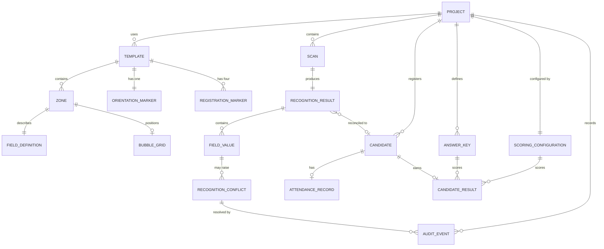

# Data model

This document describes the entities OMRFlow needs across the whole roadmap and
how they relate. It is a **design document**: most entities are not implemented
yet, and each one is marked with the phase that introduces it.

Implementing an entity early, "because we will need it anyway", is explicitly
discouraged - a speculative column is a column nobody knows the rules for. What
this document guarantees instead is that when a phase does implement its
entities, it finds the intended shape and relationships already agreed.

## Status summary

| Entity | Status | Storage |
|---|---|---|
| Project | Implemented (Phase 0) | `project.json` + `project_setting` table |
| Template, Zone, FieldDefinition, RegistrationMarker, OrientationMarker, BubbleGrid, RecognitionSettings | Implemented (Phase 0) | `.omrt` document |
| Scan | Planned (Phase 5) | database |
| RecognitionResult, FieldValue | Planned (Phase 3/5) | database |
| RecognitionConflict | Planned (Phase 6) | database |
| Candidate, AttendanceRecord | Planned (Phase 7) | database |
| AnswerKey | Planned (Phase 8) | database |
| ScoringConfiguration | Planned (Phase 8) | database |
| CandidateResult | Planned (Phase 8/9) | database |
| AuditEvent | Planned (Phase 6) | database |

## Entity relationships

## Entities

### Project - *implemented*

An examination workspace on disk. Identity lives in `project.json`; the SQLite
database is the authoritative store for working data.

| Field | Type | Notes |
|---|---|---|
| `project_format_version` | int | Refuses to open a newer format. |
| `project_id` | uuid string | Stable; never regenerated. Referenced by exports. |
| `name` | str | Also the default folder name; validated as a portable folder name. |
| `description` | str | Free text. |
| `created_at`, `modified_at` | datetime (UTC, aware) | Naive timestamps are rejected. |
| `created_with` | str | OMRFlow version, for diagnostics. |

Directory layout and rationale: `docs/decisions/ADR-0002-project-on-disk-layout.md`.

### Template and its parts - *implemented*

Fully specified in `docs/TEMPLATE_FORMAT.md`. Summary of the relationships:

- a **Template** owns exactly four **RegistrationMarkers** (one per corner role),
  exactly one **OrientationMarker**, any number of **Zones**, and one default
  **RecognitionSettings**;
- a **Zone** has bounds, one **FieldDefinition** (numeric, alphanumeric, set
  code, question block or ignored), an optional per-zone **RecognitionSettings**
  override, and - unless it is ignored - a **BubbleGrid**;
- a **BubbleGrid** stores an origin plus row/column pitch, with optional explicit
  overrides for irregular cells.

Templates are versioned documents, not database rows, so that a sheet design can
be shared between projects and reviewed in version control.

### Scan - *Phase 5*

One scanned sheet.

Intended fields: `scan_id`, `project_id`, `source_path` (relative to the project
root), `aligned_path` (relative, nullable), `checksum`, `page_index`,
`imported_at`, `status` (imported / aligned / recognised / failed),
`alignment_error` (nullable), `template_id`.

Invariants:
- original scans are never modified or moved by OMRFlow; only the path is stored,
  so importing a folder does not duplicate gigabytes of images;
- `aligned_path` points at a derived file that may be deleted and regenerated.

### RecognitionResult and FieldValue - *Phase 3/5*

`RecognitionResult` is the per-scan outcome; `FieldValue` is one recognised zone
within it.

`FieldValue` intended fields: `zone_id`, `value` (canonical string),
`confidence` (0-1), `state` (confident / missing / multiple / low_confidence),
`alternatives` (competing candidates), and the raw per-bubble measurements.

Invariant, and the reason the two are separate: **the machine value is never
overwritten.** A human correction is recorded alongside it with an `AuditEvent`,
so a result can always be traced back to what the machine actually saw. The
display strings described in the README (`?10018-10028`, `?1__18`) are rendered
from this structured data; they are never the stored form.

### RecognitionConflict - *Phase 6*

A `FieldValue` that needs human attention: multiple marks, a missing digit, a
low-confidence bubble, a duplicate or unknown candidate id, or an alignment
failure.

Intended fields: `conflict_id`, `scan_id`, `zone_id`, `kind`, `detected_at`,
`status` (open / resolved / dismissed), `resolved_value`, `resolved_by`,
`resolved_at`, `reason`.

### Candidate and AttendanceRecord - *Phase 7*

`Candidate` is an imported registration row: `candidate_id` (roll number),
`name`, `group`/`section`, `expected_set` (nullable).

`AttendanceRecord` records the declared state: `present` / `absent`, its source
(imported list or manual entry), and a timestamp.

Reconciliation compares three sets - registered candidates, declared attendance
and detected scripts - and classifies each case (normal, absent-with-script,
present-without-script, unknown roll number, duplicate script). These
classifications are computed, not stored as a candidate attribute.

Privacy: candidate names are project data. They must not appear in logs, in bug
reports or in committed fixtures.

### AnswerKey - *Phase 8*

One key per question paper set: `set_code`, `question_number`,
`correct_answers`.

`correct_answers` is a collection even though the first release assumes exactly
one correct answer, so that "any of B or C is accepted" can be introduced later
without a migration of the meaning of existing rows.

### ScoringConfiguration - *Phase 8*

`marks_correct` (default +1.00), `marks_incorrect` (default -0.25),
`marks_blank` (default 0.00), `negative_marking_enabled`, and a rounding rule.

Initially uniform across all questions. Section-wise scoring is a later
extension; it would attach a configuration to a question range rather than
changing the per-candidate result shape.

### CandidateResult - *Phase 8/9*

Per candidate: `set_code`, `attendance_state`, `correct_count`,
`incorrect_count`, `blank_count`, `positive_marks`, `negative_marks`,
`final_marks`, `rank`, `processing_status`, `remarks`.

`rank` is stored so that an exported report and the database agree, even when
the report also contains an Excel `RANK.EQ` formula.

### AuditEvent - *Phase 6*

Append-only history of anything that can change a result: `event_id`,
`occurred_at`, `actor`, `entity_type`, `entity_id`, `action`, `previous_value`,
`new_value`, `reason`.

Append-only is the whole point: rows are never updated or deleted, so the
question "why does this candidate have this mark?" always has an answer.

## Persistence strategy

Implemented in Phase 0:

| Table | Purpose |
|---|---|
| `schema_migration` | Ledger of applied migrations: version, description, timestamp, writing application version. |
| `project_setting` | Key/value mirror of project identity, so a stray `database.sqlite` can still be identified. |

Key/value storage is appropriate for a handful of identity attributes. Data that
is queried, joined, sorted or reported on - scans, candidates, results - gets
properly typed tables in the phase that introduces it. Do not extend
`project_setting` into a general-purpose object store.

Each phase adds its tables together with a migration; see
`docs/DEVELOPMENT_GUIDE.md`.
