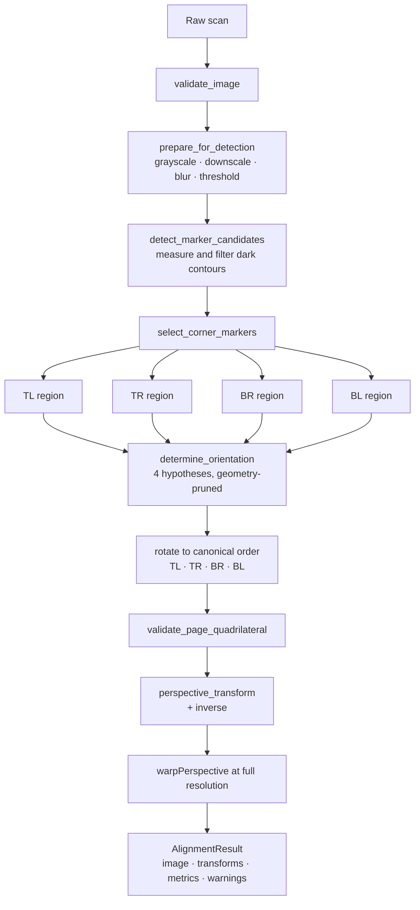
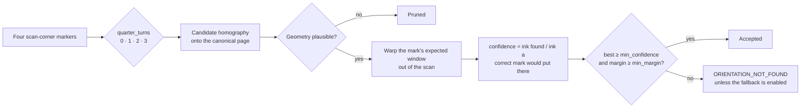

# Image processing

> **Status.** The whole pipeline is implemented and described below as it
> actually behaves: geometric normalisation (stages 1-6) in
> `omr_scanner.imaging` since Phase 1, and field extraction, bubble measurement
> and recognition (stages 7-9, §§21-23) in `omr_scanner.imaging.metrics` and
> `omr_scanner.recognition` since Phase 3. Conflict resolution between two
> readings of one sheet remains Phase 6.

## Pipeline

```text
raw scan
  -> validation                      shape, dtype, channels, minimum size
  -> preprocessing                   grayscale, downscale, denoise, threshold
  -> registration-marker detection   measure and filter every dark contour
  -> corner selection                one distinct marker per scan corner
  -> orientation determination       which scan corner is the canonical top-left
  -> corner ordering                 re-anchor to canonical corner order
  -> geometry validation             convex, sized, correctly proportioned
  -> perspective transform           marker centres -> canonical targets
  -> canonical normalised sheet      the contract every later phase consumes
  -> field extraction                template coordinates -> canonical pixels
  -> bubble measurement              per-bubble fill ratio, locally thresholded
  -> recognition                     values with explicit blank/multiple/uncertain
```

As a diagram of the implemented part:



---

## 1. Coordinate system

One convention, everywhere in OMRFlow:

```text
Origin: top-left of the image
+x:     right
+y:     down
```

This matches OpenCV, Qt and `omr_scanner.domain.geometry`, so no axis is ever
flipped at a layer boundary. Coordinates are floats, because a marker centroid
is a sub-pixel quantity.

Because `y` grows downward, the visually **clockwise** order has a *positive*
shoelace area. Every sign convention in `imaging.geometry` follows from that.

### Canonical corner order

Every sequence of four corner points in the package - detected, ordered, target
- is in this order, so an index is meaningful without a comment:

```text
0 = top-left
1 = top-right
2 = bottom-right
3 = bottom-left
```

It is published as `omr_scanner.imaging.CANONICAL_CORNER_ORDER`.

### Two different corner vocabularies

`MarkerRole` (from `domain.template`) names a corner of the **canonical page**.
`ImageCorner` (from `imaging.models`) names a corner of the **scanned image**.
They are deliberately distinct types. Detection can only say "this marker is
near the top-left of the scan"; whether that is the *sheet's* top-left depends on
how the page was fed, and is decided later. Conflating the two is exactly how an
upside-down sheet becomes a confident wrong answer.

---

## 2. Marker assumptions

The sheet format Phase 1 targets:

- one small, solid black registration square near each page corner - exactly
  four, one per corner;
- one separate orientation mark, a short dark dash, in a configurable region
  near the intended top-left corner;
- everything else on the page is content.

Scans may be rotated, translated, uniformly or non-uniformly scaled, mildly
skewed, perspective-distorted, slightly cropped, over- or under-exposed, blurred
and noisy. The measured limits are in *Known limitations* below.

The four registration squares are the **primary geometric anchors**. The paper
boundary is never detected: a sheet trimmed, folded or scanned against a dark
platen has an unreliable outline, while the printed markers are part of the
sheet design and move with it.

---

## 3. Validation and preprocessing

`preprocessing.validate_image` is the boundary where an untrusted value becomes
an array the rest of the engine trusts. It accepts 8-bit grayscale, BGR and BGRA
arrays whose shorter side is at least `min_image_dimension_px`, and rejects
everything else with `ImageValidationError`. Nothing gets far enough for an
OpenCV assertion to become the application's error interface.

`preprocessing.prepare_for_detection` then produces the two working images:

1. **Grayscale.** Always a fresh array, even when the input is already
   single-channel, so a caller holding the result can never write through it
   into the original scan.
2. **Downscale.** Detection runs on a copy whose longer side is at most
   `working_max_dimension_px`, bounding contour-finding cost on a very large
   scan. Marker geometry is judged by ratios, so *which* contour is chosen is
   unaffected; what a downscale costs is precision (see *Accuracy* below). The
   realised scale is recomputed from the achieved pixel size, because rounding
   to whole pixels makes it differ from the requested one, and mapping a centre
   back with the wrong factor would be a systematic error.
3. **Denoise.** A Gaussian blur of `blur_kernel_px`, which suppresses scanner
   speckle that would otherwise become hundreds of tiny contours.
4. **Threshold.** Ink becomes 255, paper 0.

The **output is always warped from the full-resolution original**, never from
the working copy.

### Thresholding strategies

| Strategy | Behaviour |
|---|---|
| `otsu` *(default)* | One global threshold from the image histogram. An OMR sheet is mostly white paper with sparse, strongly contrasting print, so the histogram is cleanly bimodal and a global split is both accurate and cheap. |
| `adaptive_mean`, `adaptive_gaussian` | Each pixel is compared with its neighbourhood mean. Survives a strong illumination gradient - a page lifted off the platen, the shadow of a bound spine - at the cost of turning large uniform areas into noise, which produces many more spurious contours. |

Measured on the synthetic illumination-gradient sweep (a diagonal ramp; 0.45
means the far corner is at 55 per cent of the near corner's brightness):

| Strategy | Largest survivable gradient |
|---|---|
| Otsu | 0.45 |
| Adaptive mean | 0.95 |

Otsu is the default because it is simpler and produces far fewer spurious
contours; `adaptive_mean` is the documented remedy for a scan with a visible
illumination gradient.

> **Constraint on the adaptive strategies.** `adaptive_block_ratio` must stay
> larger than the marker's own normalised size. A solid shape wider than its
> neighbourhood sets that neighbourhood's mean itself, so its interior reads as
> background and the marker comes out hollow. This is asserted by
> `tests/unit/test_imaging_preprocessing.py`.

---

## 4. Registration-marker detection

Every external dark contour is measured into a `MarkerCandidate`:

| Property | Meaning | Why it is measured this way |
|---|---|---|
| `center` | Contour centroid from image moments | An area-weighted average: a nick or blot on one edge moves it in proportion to the area affected, whereas a bounding rectangle is defined by its extreme pixels and jumps by the full amount of a single stray one. |
| `area_ratio` | Contour area / working image area | Dimensionless, so one configuration serves 150 dpi and 300 dpi alike. |
| `aspect_ratio` | Longer / shorter side of the minimum-area rectangle | Invariant to rotation; always at least 1.0, exactly 1.0 for a square. |
| `rectangularity` | Contour area / minimum-area rectangle area | 1.0 for a perfect rectangle at any rotation. Rejects crosses, ticks and torn shapes. |
| `solidity` | Contour area / convex hull area | Separates a solid blob from a ring or a jagged smear. |
| `fill_ratio` | Ink fraction of the contour's **interior**, measured on a filled mask | The property that separates a solid marker from a printed frame. Contour shape cannot: `RETR_EXTERNAL` gives an empty answer box the same outline as a filled square. |
| `extent` | Contour area / axis-aligned bounding-box area | Reported for diagnostics only; it falls with rotation, so it is not used for acceptance. |

A candidate is accepted only if **every** filter passes. This matters: a single
geometric test always has a counter-example on a real sheet. A four-vertex
polygon approximation also matches table cells and answer-box outlines; a size
test also matches a bold letter; a darkness test also matches a printed logo.
`approxPolyDP(...) == 4` is not used at all.

Rejected contours are kept, each labelled with the first filter it failed
(`area_ratio_too_large`, `fill_ratio_too_low`, …), so a miscalibrated template is
diagnosable rather than merely broken.

---

## 5. Corner search regions

Detection considers a candidate for a corner only if its centre falls inside that
corner's search region:

```text
┌──────────────┬───────────────────────────┬──────────────┐
│ TOP LEFT     │                           │ TOP RIGHT    │
│ SEARCH AREA  │                           │ SEARCH AREA  │
├──────────────┘                           └──────────────┤
│                                                         │
│                                                         │
├──────────────┐                           ┌──────────────┤
│ BOTTOM LEFT  │                           │ BOTTOM RIGHT │
│ SEARCH AREA  │                           │ SEARCH AREA  │
└──────────────┴───────────────────────────┴──────────────┘
```

The regions are fractions of the **scanned image**
(`corner_search_width` x `corner_search_height`, 0.32 x 0.32 by default), not
fixed pixel boxes, so the same configuration serves any scan resolution. They
are generous by design: a rotated page grows its own bounding canvas, which
pulls every marker inward from the image corner it belongs to.

They are expressed in scan terms rather than canonical terms on purpose. Before
orientation is known, "the canonical top-left marker" has no position in the
scan; "a marker near the scan's top-left corner" does.

Setting both to `1.0` removes the restriction entirely and detects markers
anywhere on the page - see *Known limitations*.

---

## 6. Candidate scoring and four-marker selection

Each candidate is scored against each corner as a weighted mean of two
interpretable halves:

```text
shape_score = mean(area, aspect, rectangularity, solidity, fill)
              each 1.0 at the expected value, 0.0 at the acceptance limit

proximity_score = 1.0 at the image corner,
                  falling linearly to 0.0 at the far side of the search region

score = (shape_weight * shape_score + proximity_weight * proximity_score)
        / (shape_weight + proximity_weight)
```

`area` and `aspect` are scored on a logarithmic scale, because their limits are
multiplicative: twice too large and half too large are equally wrong, and a
linear scale would treat the first as far worse.

Position is *scored*, not merely filtered, because the four largest dark shapes
on a page are not reliably its markers - a logo, a barcode or a heavily filled
answer block can all be larger.

Selection is then an **exhaustive search** over the top
`max_candidates_per_corner` candidates for each corner, maximising the total
score subject to all four being distinct contours. With four corners this is a
few hundred combinations; it is cheap and it is exact, so "first match wins"
never decides anything.

Failure is explicit:

- a corner with no candidate at or above `min_candidate_score` raises
  `InsufficientMarkersError`, naming the corner;
- candidates existing for every corner but with no injective assignment raises
  `AmbiguousMarkerError`.

---

## 7. Orientation

Four identical corner squares look the same after a half turn, and on a
near-square page after a quarter turn too. The orientation mark breaks the
symmetry.

### The strategy, and why this one

Each of the four possible assignments of scan corners to canonical roles is
turned into a candidate homography onto the canonical page, and the **expected**
location of the orientation mark is rectified out of the scan through it. The
hypothesis under which that window actually contains ink is the right one.



This tests the template's own statement about the sheet, so it needs no separate
assumption about where a mark might be, and it works for a page rotated by a
quarter turn plus 3 degrees of skew as well as for one rotated by exactly 180
degrees - the homography absorbs everything else.

Only the small window is warped, never the whole page: four small patches cost a
fraction of four full rectifications, and orientation is decided before the real
warp is ever computed.

### Geometry pruning

Before the mark is consulted, hypotheses whose quadrilateral is not a plausible
page are discarded. On A4 that alone eliminates the two quarter turns, because a
portrait marker rectangle read as landscape has an aspect ratio nowhere near the
template's. It is a free, purely geometric constraint, and it leaves the mark
with only upright-versus-inverted to settle.

### Confidence and margin

```text
confidence = ink in the evidence window / (1 / window_margin²)
margin     = best confidence - runner-up confidence (among hypotheses considered)
```

The evidence window is the printed mark scaled by `window_margin` about its
centre. It is kept tight on purpose: a large window dilutes the mark's ink with
paper and makes every hypothesis look equally weak.

The **margin matters more than the absolute confidence**. Faint print lowers
every hypothesis equally; a wrong assignment lowers only the wrong ones.

A second, larger window (`search_radius`) is used afterwards, once the decision
is made, only to report where the mark actually is.

### `quarter_turns`

The index, in the clockwise image-corner sequence, of the corner that is the
sheet's canonical top-left. Equivalently, the number of 90 degree clockwise
turns the page underwent relative to upright: a page fed a quarter turn
clockwise puts its top-left corner at the scan's top-right, which is index 1.

### Failure

If the four registration markers are found but no hypothesis reaches
`min_confidence` with at least `min_margin` over the runner-up, the sheet is
rejected with `OrientationDetectionError`, code **`ORIENTATION_NOT_FOUND`**. The
message lists the confidence of all four hypotheses.

Guessing is possible only when `OrientationConfig.allow_fallback` is explicitly
enabled. It is off by default, because an undetected upside-down sheet produces
a complete, confident and wrong set of answers. When it is on, the result
carries `orientation.assumed = True` and the warning `ORIENTATION_ASSUMED` -
never silently.

---

## 8. Corner ordering

The pipeline reaches ordering with its markers already in a clockwise cyclic
sequence (the scan's TL, TR, BR, BL), and `quarter_turns` says which of those is
the canonical top-left, so ordering is a rotation of that sequence.

`geometry.order_clockwise` exists for the general case and for the tests: it
sorts by angle about the centroid, then anchors the sequence at the vertex
closest to the "up and to the left" direction. Sorting by angle is stable under
rotation, scaling and perspective, which a sum/difference heuristic on raw
coordinates is not - for a sheared quadrilateral the smallest `x + y` can belong
to the top-right vertex. Its stated assumption is that the quadrilateral is
within 45 degrees of upright; beyond that the anchor is genuinely ambiguous from
geometry alone, which is the ambiguity the orientation mark resolves.

Tested for upright, rotated (±30°), translated, perspective-distorted and narrow
quadrilaterals, each from a scrambled input order.

---

## 9. Geometry validation

Before a transform is computed, the four ordered markers must pass, in order:

| Check | Rejects |
|---|---|
| Convexity (strict; collinear counts as failure) | Dented arrangements and ill-conditioned near-collinear ones. |
| Simplicity | A "bow tie" - two markers assigned to swapped corners, which would mirror half the page. |
| Area ratio ≥ `min_quadrilateral_area_ratio` | Four contours that happen to sit in one corner of a scan. |
| Separation ratio ≥ `min_marker_separation_ratio` | A nearly degenerate rectangle. |
| Aspect ratio within `max_aspect_ratio_deviation` of the canonical marker rectangle | A page of the wrong proportions for this template. |

Each failure raises `InvalidPageGeometryError` with a message naming the
property and the numbers involved. The function returns the signed aspect-ratio
deviation, which is recorded as a quality metric.

> The expected aspect ratio comes from the **canonical marker rectangle**, not
> the page. The markers sit inside the printed margins, so comparing against the
> page would build a constant bias into the check. For the shipped example
> template the two differ by 3 per cent.

---

## 10. What the transform maps onto what

**Detected registration-marker centres are mapped onto their expected canonical
marker-centre coordinates.** Not onto the page corners.

The template declares where each marker centre sits on the canonical page, as a
normalised coordinate:

```text
TL = (0.05, 0.035)      TR = (0.95, 0.035)
BL = (0.05, 0.965)      BR = (0.95, 0.965)
```

which becomes, on a 1240 x 1754 canonical page:

```text
x_canonical = 0.05  × 1240 =  62.0
y_canonical = 0.035 × 1754 =  61.4
```

`AlignmentConfig.canonical_marker_points()` performs this conversion;
`normalized_to_canonical()` does it for any single point.

If the markers were mapped to the image corners instead, the printed margin
outside them would be stretched across the whole output, every template
coordinate would shift, and the amount of the shift would depend on the marker
inset. Mapping centre-to-centre keeps the canonical page an exact scale model of
the printed sheet.

---

## 11. Homography and output

`cv2.getPerspectiveTransform` on the four correspondences, then
`cv2.warpPerspective` at the full source resolution into the canonical size.
Four correspondences determine a homography exactly, so no least-squares fit is
involved.

- `transform_matrix` maps source-image pixels to canonical pixels.
- `inverse_transform_matrix` maps canonical pixels back to the original scan -
  what a GUI overlay needs to point at the original paper during conflict
  review (Phase 6).

Area of the canonical page the scan does not cover is filled with **white**, so
a slightly cropped scan produces blank paper where data is missing rather than a
black band that later reads as heavy ink.

The output has exactly the configured canonical size and the same channel layout
as the input.

---

## 12. Quality metrics

`AlignmentResult.metrics` is several named numbers rather than one opaque
confidence: a single blended score cannot tell a faint orientation mark apart
from a skewed page, and those two need different human responses.

| Metric | Meaning |
|---|---|
| `candidate_count`, `rejected_count` | Contours that passed and failed the shape filters. |
| `marker_scores`, `min_marker_score` | Selection score per canonical corner. |
| `quadrilateral_area_ratio` | Marker quadrilateral area / scan area. Small values cost effective resolution. |
| `source_aspect_ratio`, `expected_aspect_ratio`, `aspect_ratio_deviation` | Measured page proportions against the template's. |
| `min_marker_separation_px` | Shortest distance between any two selected markers. |
| `orientation_confidence`, `orientation_margin` | Evidence for the chosen orientation. |
| `mean_reprojection_error_px`, `max_reprojection_error_px` | See below. |
| `working_scale` | Detection downscale factor; 1.0 at full resolution. |
| `elapsed_seconds` | Wall-clock duration of the call. |

### Reprojection error is not accuracy

Each detected marker centre is mapped through the transform and compared with
its canonical target. **With exactly four correspondences the homography is
exact**, so this number is ~1e-4 px no matter how wrong detection was. It
measures numerical conditioning, not geometry, and is recorded because a large
value means the solve went wrong.

Geometric accuracy is measured instead with **interior control points** that
took no part in the fit - see *Accuracy* below and `docs/TESTING.md`.

---

## 13. Warnings

Non-fatal observations recorded alongside a successful alignment. A warning
never changes the produced image; this is asserted by a test.

| Warning | Raised when |
|---|---|
| `LOW_MARKER_SCORE` | A selected marker scored close to the acceptance threshold. |
| `LOW_MARKER_RECTANGULARITY` | A selected marker fits its minimum-area rectangle poorly. |
| `MULTIPLE_CORNER_CANDIDATES` | A corner had more than one plausible candidate. |
| `MARKER_NEAR_IMAGE_EDGE` | A marker touches the image border; the scan may be cropped. |
| `LOW_ORIENTATION_CONFIDENCE` | The orientation mark was found, but faintly. |
| `ORIENTATION_ASSUMED` | No mark was found and the configured fallback was used. |
| `ASPECT_RATIO_DEVIATION` | The page proportions are far from the template's. |
| `LARGE_REPROJECTION_ERROR` | The fitted transform does not reproduce its own control points. |

---

## 14. Failure modes

Every deliberate failure is a subclass of `ImagingError` carrying a stable
machine-readable `code` and a plain-language `user_message`. Nothing returns
`None` or a blank result to mean "it did not work": a sheet that could not be
aligned must be visible as a failure, not as an empty answer sheet.

| Exception | `code` | Raised when |
|---|---|---|
| `ImageValidationError` | `INVALID_IMAGE` | Not an array, not 8-bit, wrong dimensionality or channel count, empty, or too small. |
| `InsufficientMarkersError` | `INSUFFICIENT_MARKERS` | A corner produced no acceptable candidate. |
| `AmbiguousMarkerError` | `AMBIGUOUS_MARKERS` | No assignment uses four distinct contours. |
| `OrientationDetectionError` | `ORIENTATION_NOT_FOUND` | No orientation hypothesis was confident and unambiguous. |
| `InvalidPageGeometryError` | `INVALID_PAGE_GEOMETRY` | The markers cannot bound a page. |
| `AlignmentTransformError` | `ALIGNMENT_TRANSFORM_FAILED` | The homography could not be computed or inverted. |

### Partial cropping

If a marker is genuinely missing because the scan is cropped, alignment
**fails**. Phase 1 never extrapolates a missing corner. Three real corners plus
one invented one produces a plausible rectification and a complete set of wrong
answers that nobody looks at again; a visible failure gets the sheet rescanned.
A future phase may add a fallback, and would have to signal it as loudly as the
orientation fallback is signalled.

---

## 15. Configuration

Every tunable number lives in `omr_scanner.imaging.config`, named, documented
and validated at construction. Any value whose name ends in `_px` is pixels;
everything else is a fraction of the canonical page (or, where the docstring
says so, of the scanned image).

| Group | Contains |
|---|---|
| `AlignmentConfig` | `canonical_width`, `canonical_height`, `marker_targets`, `diagnostics`, and the four groups below. |
| `PreprocessingConfig` | `min_image_dimension_px`, `working_max_dimension_px`, `blur_kernel_px`, `threshold_strategy`, `adaptive_block_ratio`, `adaptive_offset`. |
| `MarkerDetectionConfig` | `expected_marker_width/height`, `marker_area_tolerance`, `marker_aspect_tolerance`, `min_marker_area_px`, `min_rectangularity`, `min_solidity`, `min_fill_ratio`, `corner_search_width/height`, `min_candidate_score`, `max_candidates_per_corner`, `shape_weight`, `proximity_weight`, warning thresholds. |
| `OrientationConfig` | `marker_center_x/y`, `marker_width/height`, `window_margin`, `search_radius`, `min_confidence`, `min_margin`, `low_confidence_warning`, `allow_fallback`, `fallback_quarter_turns`. |
| `GeometryConfig` | `min_quadrilateral_area_ratio`, `min_marker_separation_ratio`, `max_aspect_ratio_deviation`, `aspect_ratio_warning_deviation`, `max_reprojection_error_px`. |

Derived quantities (`marker_area_ratio_bounds`, `marker_aspect_ratio_bounds`,
`expected_quadrilateral_aspect_ratio`, `canonical_marker_points`) are computed
from those, never stored separately.

The shipped defaults describe the example sheet in
`resources/templates/example_answer_sheet.omrt` - A4 at 150 dpi with four 3 mm
corner squares. They exist so the developer tools and the tests have something
to run against; in production every geometric value is replaced from the
template.

### Where configuration comes from in production

```python
from omr_scanner.imaging import align_sheet
from omr_scanner.services import alignment_config_from_template, load_template

template = load_template(path)
config = alignment_config_from_template(template)
result = align_sheet(scan, config=config)
```

`alignment_config_from_template` lives in `services`, not `imaging`. The
template is the *source* of these values, but the imaging layer takes plain
geometry so that it stays testable with synthetic sheets that have no template
at all, and never depends on a particular file format. The template supplies the
canonical page size, the four marker centres, the printed marker size and the
orientation mark; thresholds and score weights are engine tuning, not sheet
design, and keep their defaults.

---

## 16. Public API

```python
from omr_scanner.imaging import AlignmentConfig, align_sheet

result = align_sheet(image=scan, config=config)

result.normalized_image           # canonical page, exactly the configured size
result.transform_matrix           # scan -> canonical
result.inverse_transform_matrix   # canonical -> scan
result.corner_markers             # four detections, TL TR BR BL
result.marker(MarkerRole.TOP_LEFT)
result.orientation.quarter_turns
result.metrics
result.warnings
result.diagnostics                # only when config.diagnostics is True
```

`config` is optional; omitting it uses the defaults above.

---

## 17. Accuracy

Measured on the synthetic suite in `tests/integration/test_alignment.py`:
40 distortion cases x 9 interior control points = 360 measurements, on the
default 1240 x 1754 canonical page.

```text
mean                0.062 px
median              0.059 px
95th percentile     0.145 px
maximum             0.394 px
failures            0
regression limit    1.5 px   (CONTROL_POINT_TOLERANCE_PX)
```

The control points take no part in fitting the homography, so these numbers
measure recovered geometry rather than the fit's own residual.

The regression limit is roughly a tenth of a printed marker's width and two
orders of magnitude below a bubble pitch, so an error at this scale cannot move
a Phase 3 measurement window onto the wrong bubble.

### Orientation

| Feed orientation | `quarter_turns` | Confidence | Margin |
|---|---|---|---|
| 0° | 0 | 1.00 | 1.00 |
| 90° | 1 | 1.00 | 1.00 |
| 180° | 2 | 1.00 | 1.00 |
| 270° | 3 | 1.00 | 1.00 |

### Resolution independence and timing

One configuration (scaled canonical size only) across four resolutions, on a
4° rotation plus 2 per cent perspective. Times are the best of five runs of the
whole `align_sheet` call on Windows 11 / Python 3.12.7:

| Canonical page | Scan size | `working_scale` | Max control-point error | Time |
|---|---|---|---|---|
| 620 x 877 | 753 x 1014 | 1.000 | 0.178 px | 5.9 ms |
| 1240 x 1754 (A4 @150 dpi) | 1427 x 1947 | 1.000 | 0.087 px | 12.2 ms |
| 1748 x 2480 (A4 @210 dpi) | 1979 x 2720 | 1.000 | 0.150 px | 17.7 ms |
| 2480 x 3508 (A4 @300 dpi) | 2773 x 3815 | 0.944 | 0.486 px | 39.4 ms |

Error is roughly inversely proportional to the achieved working scale, because a
marker centroid measured on the working copy is multiplied back up. On A4 at 300
dpi the measured maxima are 0.14 px at full resolution, 0.45 px at scale 0.63
and 1.12 px at scale 0.42. `working_max_dimension_px` is the single knob.

---

## 18. Diagnostics

Off by default (`AlignmentConfig.diagnostics`), because they retain two
working-resolution images per sheet. When on, `result.diagnostics` carries the
grayscale and binary working images, every accepted candidate, every rejection
with its reason, every candidate scored against every corner, and the source
quadrilateral.

`imaging.diagnostics` renders them:

- `render_detection_overlay(image, result)` - candidates, rejections, the four
  chosen markers labelled TL/TR/BR/BL with their scores, the orientation mark
  and the source quadrilateral, drawn on a colour copy of the scan;
- `render_normalized_preview(result, config=config)` - the rectified page with
  the expected canonical marker centres drawn as crosses. On a correct alignment
  every cross sits in the middle of a printed marker; a consistent offset is what
  a miscalibrated template looks like;
- `summarize(result)` - the measured metrics as text.

These functions return arrays and strings; they never write files, and they are
produced *from* a finished result and cannot change it. Nothing in the pipeline
calls into the module.

---

## 19. Developer tools

Neither is a user-facing interface; both are documented here because they are
how an alignment gets inspected while it is being tuned.

```bash
# Render a synthetic sheet, optionally distorted, and print its ground truth
python -m omr_scanner.tools.make_test_sheet scan.png \
    --rotate 6 --scale 0.9 --perspective 0.02 --blur 3 --noise 4 --seed 7

# Align one scan and report what was measured
python -m omr_scanner.tools.align_image scan.png \
    --template resources/templates/example_answer_sheet.omrt \
    --output aligned.png --debug debug/
```

`align_image` exits 0 on success and 1 on a refusal, printing the failure's
`code` to stderr. With `--debug` it writes `detection.png`, `normalized.png` and
`summary.txt` into the named directory. Neither tool overwrites an existing file
unless `--overwrite` is given.

---

## 20. Known limitations

Measured against the default configuration on the synthetic suite. Each is a
boundary the engine is known to hold up to, not a guess.

| Degradation | Survives up to | Beyond that |
|---|---|---|
| Rotation, arbitrary angle | **±15°** | `INSUFFICIENT_MARKERS`. At larger angles the page's bounding canvas grows enough that the markers leave the corner search regions; at 45° they sit at the canvas edge midpoints, where no corner region can reach them. Exact quarter turns (90/180/270) are unaffected, because the canvas rotates with the page. Setting `corner_search_width` and `corner_search_height` to 1.0 removes the restriction and aligns 20°-75° correctly, at the cost of no positional filtering - acceptable for a clean sheet, riskier on a cluttered one. |
| Perspective (corner displacement) | ≥ 20 per cent of the shorter page side | Untested beyond; `LOW_MARKER_RECTANGULARITY` appears from about 16 per cent. |
| Gaussian blur | ≥ 41 px kernel | Untested beyond. |
| Gaussian noise | ≥ σ 60 grey levels | Untested beyond. |
| Uniform exposure | gain 0.12 to offset +200 | A histogram-derived threshold is unaffected by a uniform change. |
| Illumination gradient | 0.45 (Otsu), 0.95 (adaptive mean) | `INSUFFICIENT_MARKERS`. Switch `threshold_strategy`. |
| JPEG compression | quality 4 | Untested beyond. |
| Cropping | 60 px into the page margin on a 1240 px page (≈5 per cent of the width) | `INSUFFICIENT_MARKERS`. `MARKER_NEAR_IMAGE_EDGE` warns from about 45 px. |

Other limitations, stated plainly:

- **No real-world validation has been performed.** Every number above comes from
  synthetic sheets. Pencil texture, scanner shadows, print registration error
  and paper texture are not represented. This is the largest open risk in
  Phase 1, and it is why `tests/fixtures/images/anonymized/` exists as a
  reserved, empty directory with a documented policy.
- Only `filled_square`-style markers are exercised. `MarkerShape.FILLED_CIRCLE`
  would pass the default filters (a disc has rectangularity π/4 ≈ 0.785, above
  the 0.75 floor), but no test covers it and `shape` is not consulted.
- A missing marker is never extrapolated. By design; see *Partial cropping*.
- Multi-page documents, ArUco/QR fiducials, arbitrary page layouts and
  photographs with severe perspective are out of scope, deliberately.
- Detection is single-threaded and processes one sheet per call. Batch
  parallelism arrives in Phase 5.

---

## 21. Field extraction - *Phase 3, implemented*

For each zone, every bubble centre comes from its `BubbleGrid.bubble_center`
(pure geometry in `omr_scanner.domain.template`, unchanged since Phase 0) and is
scaled from normalised template coordinates to canonical page pixels. No page
coordinate is ever hard-coded: a template that moves a region moves the sampling
with it, which is what
`tests/integration/test_recognition_pipeline.py` asserts directly.

Because sampling happens on the *canonical* page, template coordinates need no
correction for the scan's rotation, scale or resolution - the homography of
stage 6 already removed all three.

## 22. Bubble measurement - *Phase 3, implemented*

`omr_scanner.imaging.metrics` produces a *measurement*, never a verdict.

Per bubble:

| Quantity | How |
|---|---|
| Interior sample | An **ellipse** at `sample_radius_ratio` (0.62) of the bubble's half-axes - inside the printed ring, covering most of what a candidate actually shades. |
| Local paper level | The `paper_percentile` (80th) of an **annulus** from 1.25 to 1.95 half-axes. A high percentile rather than a mean, because the annulus routinely catches a grid line, a neighbouring mark or the printed symbol beside the bubble; the brightest pixels of a small neighbourhood are the ones reliably paper. |
| Page ink level | The `ink_percentile` (1st) of the whole page - the printed text, registration squares and marks. Not the single darkest pixel, which is noise. |
| Ink threshold | Halfway (`ink_fraction` 0.5) between local paper and page ink, clamped to 35-130 grey levels. |
| `fill_ratio` | Fraction of the interior sample darker than that threshold. |
| Usability | `False` when fewer than `min_sample_pixels` (9) interior pixels are available - a bubble whose sample runs off the page edge is reported unusable, never guessed. |
| Sampled extent | `sample_half_width` / `sample_half_height`, recorded at the moment the interior mask is built and reported on every return path, unusable ones included. |

**The sampled region is smaller than the printed bubble, and that difference
is load-bearing for anything that draws it.** On the repository's real sample,
a printed 36.0 px bubble is measured over a 22.3 px ellipse - about 38 per cent
of the area. Anything showing an operator "the region recognition measured"
must read `sample_half_width`/`sample_half_height`; drawing the printed size
instead shows a region 2.6x too large, which makes a template whose windows
are half off the printed bubbles still look enclosed. The Phase 4 calibration
overlay draws both, as separate and separately-labelled layers
(`docs/calibration_workflow.md`).

**Why the threshold is local and relative.** Two problems that an absolute
threshold gets wrong in opposite directions:

- Every empty bubble on the sample sheet contains a *printed option glyph*
  (`a`, `b`, `c`, `d`). An absolute dark-pixel count reads that as a mark.
- A candidate who marks lightly in pencil throughout produces bubbles that are
  all faint, and an absolute threshold reads the whole sheet as blank.

Halfway between local paper and page ink separates them: the printed glyph is
light grey, well under halfway; a pencil mark is well over it. On the real
sample this produces a **fill-ratio gap of more than 0.5** between the faintest
mark and the darkest unmarked bubble - a wide, unambiguous separation rather
than a threshold sitting between two touching populations. That margin is
asserted as a regression test in
`tests/integration/test_sample_sheet_recognition.py`.

Every value in `BubbleMetricsConfig` is a ratio or a grey-level difference, not
a pixel count, so one configuration serves 150 dpi and 300 dpi alike.

## 23. Recognition - *Phase 3 implemented, conflicts in Phase 6*

`omr_scanner.recognition.decide` turns one group of measured bubbles into one
`Selection`, using the template's `RecognitionSettings` - never a constant in
the recognition code:

- above `fill_ratio_threshold` -> marked;
- below `blank_ratio_threshold` -> empty;
- in between, or a gap smaller than `ambiguity_margin` between the best and
  second-best candidate -> ambiguous.

`recognition.fields` then assembles groups into fields. Each group's outcome is
one of five explicit states - resolved, blank, multiple, uncertain, unreadable -
and each survives all the way to the GUI and the CSV.

**Ambiguity is preserved, never resolved by guessing.** Two marks are reported
as `b-d`, with both retained; an uncertain one as `b?`; an unreadable group as
`?`. A roll number is only offered as an identifier when every digit column
resolved, so `21?3123` never becomes a file name. Phase 6 gets the competing
alternatives to present to a human, because nothing discarded them.

---

## Constraints on the implementation

These held through Phase 1 and continue to hold:

1. **No Qt in `imaging`.** The layer runs in a headless worker and in tests
   without a display. Turning an array into a `QImage` is the GUI's job.
   Enforced by `tests/unit/test_architecture.py`.
2. **No unexplained thresholds in code.** Every tunable is a named, documented
   configuration field; every geometric value comes from the template.
3. **Functions take arrays and plain data**, not an `OmrTemplate`.
4. **Failures raise `ImagingError`**, never return a sentinel.
5. **The caller's image is never modified.** Every stage returns a new array.
6. **The output contract** is the canonical page at exactly
   `canonical_width` x `canonical_height`.
7. **Diagnostics are first class and inert.**
